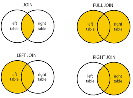

# Combine with Clinical

This is a tricky part. Not because the R-code is complicated, but because clinical data comes in all sizes and shapes.

Inside your clinical data file (preferably a CSV) you want:

- COLUMN with same sample names as in Fragpipe/DIA-NN output
- Any additional clinical column


```{r}
library(tidyverse)
postOutlierAndNormal <- read_csv("postOutlierAndNormal.csv")
```
## Import the Clinical file

First we import the clinical. Since the sampleID is full of numbers R thinks its numbers, but we want it to be characters. Lets also change that here.

For visualization the table1-package is straightforward to use. Below a small example, but of course more info can be found on:

https://cran.r-project.org/web/packages/table1/vignettes/table1-examples.html


```{r}
library(table1)

clinical_data <- read_csv("Clinical.csv")

clinical_data <- clinical_data %>%
  mutate(SampleID = as.character(SampleID))

table1::table1(~ DX + Fake_Age | DX, data = clinical_data)
```
## checking and preparing

To combine its important to notice with which parts we can connect the two dataframes. Lets have a look at those.

```{r}
knitr::kable(head(postOutlierAndNormal), caption = "Example of the Results", floating.environment="sidewaystable")
knitr::kable(head(clinical_data), caption = "Example of the Results", floating.environment="sidewaystable")
```

In the two dataframes we see the following structures:

- protein-level sample = DIA_1_S5-B1_1_12203
- clinical sampleID = 1

It therefore seems we need to 'clean' the protein level sample column from all except those identifying numbers, here it is the second item when a "_" delimits the info. Lets do that.

```{r}
postOutlierAndNormal_clean <- postOutlierAndNormal %>%
  separate(Sample, sep = "_", into = c("Acquistion", "sampleNumber", "PlateInfo", "timsTOF_stuff", "runOrder")) %>%
  
  #NOTE!! WE CAN REMOVE THE COLUMNS WERE NOT INTERESTED IN BY SELECTING THE ONES WE WANT TO KEEP
  dplyr::select(Protein, sampleNumber, Intensity) #We do the the 'dplyr::' before select because select is used by multiple packages, often causing errors.

knitr::kable(head(postOutlierAndNormal_clean), caption = "Example of the Results", floating.environment="sidewaystable")
```

## Joining the two dataframes

With that done we can join them! There's multiple types of join.

```{r ssa-logo, fig.align = 'center', out.width = "50%", fig.cap = "Example of wide and long format"}

```
Depending on what you want you can use one of those. We want to use the top-left one, which in R is called inner_join. It makes sure you will not have missing values on either side of the dataframe.

As you can see, it created the dataframe with clinical info AND protein ID & quantity, all in one in the LONG format. 

```{r}
clinical_and_protein_joined <- inner_join(
  clinical_data,
  postOutlierAndNormal_clean,
  by = c("SampleID" = "sampleNumber")
)

knitr::kable(head(clinical_and_protein_joined), caption = "Example of the Results", floating.environment="sidewaystable")

```
