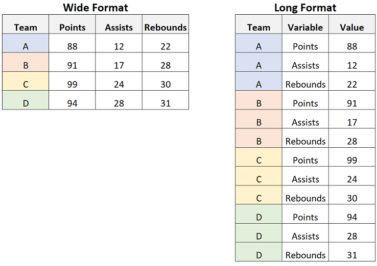

# Introduction

Proteomics data from tools such as MSFragger or DIA-NN often comes in a .csv (comma-separated) or .tsv (tab-separated) format. First, we need to extract the information we actually want to use, versus the columns we do not care so much about.

```{r}
#import library
library(tidyverse)
```


#### Wide vs long (tidy) format.

In Excel it makes sense to store each sample in a seperate column. In R, however, this is highly annoying as you would have to specify the name of each sample. Instead, its easier to put it in a long format. The long format is commonly used in the so called "tidyverse", which is a very useful tool for statistics and visualization in R. 


```{r ssa-logo, fig.align = 'center', out.width = "50%", fig.cap = "Example of wide and long format"}


```
# Importing - MSFragger

MSFragger creates the following files:

- combined_protein.tsv
- combined_peptide.tsv
- combined_modified_peptide.tsv

We can import these through the script/function below.

## Protein - Level Data

Will need four inputs:

- The MSFragger combined_protein file
- If you want Intensity, Total, or Unique
- If you want the MaxLFQ or normal version of that?
- cut off (0 if none)

### The function
```{r}
clean_combined_protein_fragger <- function(dataset, Intensity, MaxLFQ, cutoff){
  
  #change Protein name
  names(dataset)[names(dataset) == 'Protein ID'] <- 'ProteinID'
  
  #Select columns of interest
  dataset <- dplyr::mutate(dataset, Protein = paste0(ProteinID, "_", Gene))
  
  # Select the specified Intensity. 
  # We also start creating the substring we will remove from sample names.
  if (Intensity == "Intensity" || Intensity == "intensity"){
    dataset <- dplyr::select(dataset, Protein, contains("Intensity"), -contains("Total"), -contains("Unique"))
    removeSubString <- paste0(" ", "Intensity")
  } else if (Intensity == "Total" || Intensity == "total"){
    dataset <- dplyr::select(dataset, Protein, contains("Total Intensity"))
    removeSubString <- paste0(" ", "Total", " Intensity")
  } else if (Intensity == "Unique" || Intensity == "unique"){
    dataset <- dplyr::select(dataset, Protein, contains("Unique Intensity"))
    removeSubString <- paste0(" ", "Unique", " Intensity")
  } else {
    print("Something went wrong with selecting which Intensity. You sure you wrote it right? Choose from Total, Unique or Intensity")
  }
  
  #select or not select MaxLFQ
  if (MaxLFQ == "MaxLFQ" || MaxLFQ == "maxlfq" || MaxLFQ == "MAXLFQ" || MaxLFQ == "max lfq"){
    dataset <- dplyr::select(dataset, Protein, contains("MaxLFQ"))
    removeSubString <- paste0(" MaxLFQ", removeSubString)
  } else if(MaxLFQ == "None" || MaxLFQ == "none"){
    dataset <- dplyr::select(dataset, Protein, contains("Intensity"), -contains("MaxLFQ"))
  } else {
    print("Something went wrong. You have to write MaxLFQ or None(for no MAXLFQ selection)")
    print("Alternativly, you might have selected MaxLFQ but you used old version of Fragpipe (its been there since 17.0/17.1")
  }
  
  #col to rowname
  dataset <- tibble::column_to_rownames(dataset, "Protein")
  
  #Get rid of substring part we do not need
  colnames(dataset) <- stringr::str_remove(colnames(dataset), removeSubString)
  
  #transpose, remove zeros, log2
  dataset <- data.frame(t(dataset))
  dataset <- dplyr::na_if(dataset, 0)
  dataset <- log2(dataset)
  
  #apply cutoff on the protein level
  if (cutoff %in% 0:100){
    dataset <- purrr::discard(dataset, ~sum(is.na(.x))/length(.x)* 100 >= (100-cutoff))
  } else {
    print("You selected a cut off filter out of 0 until 100.....")
    print("Or maybe you wrote it as a string (if it has quotation marks around it)")
  }
  
  #Long Format it
  dataset <- tibble::rownames_to_column(dataset, "Sample")
  dataset <- tidyr::gather(dataset, colnames(dataset)[2:ncol(dataset)], key = "Protein", value = "Intensity") 

  return(dataset)
}
```

### Usage
```{r, results='asis'}
cleanedDF <- clean_combined_protein_fragger(
  read_tsv("combined_protein.tsv"),
  Intensity = "Intensity", #You can choose others, such as Unique, Total, or just Intensity
  MaxLFQ = "None", #You can choose MaxLFQ or None
  cutoff = 0
)

knitr::kable(head(cleanedDF), caption = "Example of the Results", floating.environment="sidewaystable")
```


## peptide - Level Data without modifications

Will need four inputs:

- The MSFragger combined_peptide file
- If you want Intensity, Total, or Unique
- If you want the MaxLFQ or normal version of that?
- cut off (0 if none)

NOTE: Fragpipe sometimes changes the column names of result files.... Thus, you might have to adapt. For example, Sequence column got changed to 'peptide Sequence' leading to needing to adjust for that.

### The function
```{r}

clean_combined_peptide_fragger <- function(dataset, Intensity, MaxLFQ, cutoff){
  

  #change Protein name
  names(dataset)[names(dataset) == 'Protein ID'] <- 'ProteinID'
  names(dataset)[names(dataset) == 'Peptide Sequence'] <- 'Sequence'

  #Select columns of interest
  dataset <- dplyr::mutate(dataset, Protein = paste0(ProteinID, "_", Gene, "_", Sequence))
  
  # Select the specified Intensity. 
  # We also start creating the substring we will remove from sample names.
  if (Intensity == "Intensity" || Intensity == "intensity"){
    dataset <- dplyr::select(dataset, Protein, contains("Intensity"), -contains("Total"), -contains("Unique"))
    removeSubString <- paste0(" ", "Intensity")
  } else if (Intensity == "Total" || Intensity == "total"){
    dataset <- dplyr::select(dataset, Protein, contains("Total Intensity"))
    removeSubString <- paste0(" ", "Total", " Intensity")
  } else if (Intensity == "Unique" || Intensity == "unique"){
    dataset <- dplyr::select(dataset, Protein, contains("Unique Intensity"))
    removeSubString <- paste0(" ", "Unique", " Intensity")
  } else {
    print("Something went wrong with selecting which Intensity. You sure you wrote it right? Choose from Total, Unique or Intensity")
  }
  
  #select or not select MaxLFQ
  if (MaxLFQ == "MaxLFQ" || MaxLFQ == "maxlfq" || MaxLFQ == "MAXLFQ" || MaxLFQ == "max lfq"){
    dataset <- dplyr::select(dataset, Protein, contains("MaxLFQ"))
    removeSubString <- paste0(" MaxLFQ", removeSubString)
  } else if(MaxLFQ == "None" || MaxLFQ == "none"){
    dataset <- dplyr::select(dataset, Protein, contains("Intensity"), -contains("MaxLFQ"))
  } else {
    print("Something went wrong. You have to write MaxLFQ or None(for no MAXLFQ selection)")
    print("Alternativly, you might have selected MaxLFQ but you used old version of Fragpipe (its been there since 17.0/17.1")
  }
  
  #col to rowname
  dataset <- tibble::column_to_rownames(dataset, "Protein")
  
  #Get rid of substring part we do not need
  colnames(dataset) <- stringr::str_remove(colnames(dataset), removeSubString)
  
  #transpose, remove zeros, log2
  dataset <- data.frame(t(dataset))
  dataset <- dplyr::na_if(dataset, 0)
  dataset <- log2(dataset)
  
  #apply cutoff on the protein level
  if (cutoff %in% 0:100){
    dataset <- purrr::discard(dataset, ~sum(is.na(.x))/length(.x)* 100 >= (100-cutoff))
  } else {
    print("You selected a cut off filter out of 0 until 100.....")
    print("Or maybe you wrote it as a string (if it has quotation marks around it)")
  }
  
  #Long Format it
  dataset <- tibble::rownames_to_column(dataset, "Sample")
  dataset <- tidyr::gather(dataset, colnames(dataset)[2:ncol(dataset)], key = "Protein", value = "Intensity") 
  
  return(dataset)
}
```

### Usage
```{r}
cleanedDF <- clean_combined_peptide_fragger(
  read_tsv("combined_peptide.tsv"),
  Intensity = "Intensity", #You can choose others, such as Unique, Total, or just Intensity
  MaxLFQ = "None", #You can choose MaxLFQ or None
  cutoff = 0
)

knitr::kable(head(cleanedDF), caption = "Example of the Results", floating.environment="sidewaystable")
```

## peptide - Level Data WITH modifications

Will need four inputs:

- The MSFragger combined_modified_peptide file
- If you want Intensity, Total, or Unique
- If you want the MaxLFQ or normal version of that?
- cut off (0 if none)

NOTE: Fragpipe sometimes changes the column names of result files.... Thus, you might have to adapt. For example, Sequence column got changed to 'peptide Sequence' leading to needing to adjust for that.

### The function
```{r}
clean_combined_modifiedpeptide_fragger <- function(dataset, Intensity, MaxLFQ, cutoff){
  

  #change Protein name
  names(dataset)[names(dataset) == 'Protein ID'] <- 'ProteinID'
  names(dataset)[names(dataset) == 'Modified Sequence'] <- 'ModifiedSequence'
  names(dataset)[names(dataset) == 'Prev AA'] <- 'PrevAA'
  names(dataset)[names(dataset) == 'Next AA'] <- 'NextAA'
  
  #Select columns of interest
  dataset <- dplyr::mutate(dataset, Protein = paste0(ProteinID, "_", Gene, "_", ModifiedSequence, "_", PrevAA, "_", NextAA))
  
  # Select the specified Intensity. 
  # We also start creating the substring we will remove from sample names.
  if (Intensity == "Intensity" || Intensity == "intensity"){
    dataset <- dplyr::select(dataset, Protein, contains("Intensity"), -contains("Total"), -contains("Unique"))
    removeSubString <- paste0(" ", "Intensity")
  } else if (Intensity == "Total" || Intensity == "total"){
    dataset <- dplyr::select(dataset, Protein, contains("Total Intensity"))
    removeSubString <- paste0(" ", "Total", " Intensity")
  } else if (Intensity == "Unique" || Intensity == "unique"){
    dataset <- dplyr::select(dataset, Protein, contains("Unique Intensity"))
    removeSubString <- paste0(" ", "Unique", " Intensity")
  } else {
    print("Something went wrong with selecting which Intensity. You sure you wrote it right? Choose from Total, Unique or Intensity")
  }
  
  #select or not select MaxLFQ
  if (MaxLFQ == "MaxLFQ" || MaxLFQ == "maxlfq" || MaxLFQ == "MAXLFQ" || MaxLFQ == "max lfq"){
    dataset <- dplyr::select(dataset, Protein, contains("MaxLFQ"))
    removeSubString <- paste0(" MaxLFQ", removeSubString)
  } else if(MaxLFQ == "None" || MaxLFQ == "none"){
    dataset <- dplyr::select(dataset, Protein, contains("Intensity"), -contains("MaxLFQ"))
  } else {
    print("Something went wrong. You have to write MaxLFQ or None(for no MAXLFQ selection)")
    print("Alternativly, you might have selected MaxLFQ but you used old version of Fragpipe (its been there since 17.0/17.1")
  }
  
  #col to rowname
  dataset <- tibble::column_to_rownames(dataset, "Protein")
  
  #Get rid of substring part we do not need
  colnames(dataset) <- stringr::str_remove(colnames(dataset), removeSubString)
  
  #transpose, remove zeros, log2
  dataset <- data.frame(t(dataset))
  dataset <- dplyr::na_if(dataset, 0)
  dataset <- log2(dataset)
  
  #apply cutoff on the protein level
  if (cutoff %in% 0:100){
    dataset <- purrr::discard(dataset, ~sum(is.na(.x))/length(.x)* 100 >= (100-cutoff))
  } else {
    print("You selected a cut off filter out of 0 until 100.....")
    print("Or maybe you wrote it as a string (if it has quotation marks around it)")
  }
  
  #Long Format it
  dataset <- tibble::rownames_to_column(dataset, "Sample")
  dataset <- tidyr::gather(dataset, colnames(dataset)[2:ncol(dataset)], key = "Protein", value = "Intensity") 
  
  return(dataset)
}
```

### Usage

Hanno once wanted info on the amino-acid (AA) before and after the sequence. I added that to this function. It can be removed or adjusted in the function where you specify the columns you are interested in.

```{r}
cleanedDF <- clean_combined_modifiedpeptide_fragger(
  read_tsv("combined_modified_peptide.tsv"),
  Intensity = "Intensity", #You can choose others, such as Unique, Total, or just Intensity
  MaxLFQ = "None", #You can choose MaxLFQ or None
  cutoff = 0
)

knitr::kable(head(cleanedDF), caption = "Example of the Results", floating.environment="sidewaystable")
```

# Importing - DIA-NN

DIA-NN data comes in a slightly different format. Furthermore, it does not differentiate between a modified and non-modified peptide datafile.

- protein-groups file comes with a XXX.pg_matrix.tsv format
- the peptide-groups file comes with a XXX.pr_matrix.tsv format

Similair to Fragpipe output, we import and make some adjustments to put it in that long format again.

### Protein - Level Data

```{r}
#Functions to load in Protein Level DIA_NN dataframes
#Will need two inputs
# The DIA_NN <SOMETHING>.pg_matrix.tsv file
# cut off (0 if none)

clean_combined_protein_diann <- function(dataset, cutoff){
  
  #combine the ProteinGroup and Genes
  dataset <- dplyr::mutate(dataset, Protein = paste0(Protein.Group, "_", Genes))
  
  #Proteins to rownames
  dataset <- tibble::column_to_rownames(dataset, "Protein")
  
  #deselect the not-user stuff
  dataset <- dplyr::select(dataset, - Protein.Ids,- Protein.Names, - Genes, - First.Protein.Description, - Protein.Group)
  
  #Clean the Sample Names
  colnames(dataset) <- sapply(strsplit(colnames(dataset), "\\", fixed=TRUE), tail, 1)
  colnames(dataset) <- stringr::str_remove(colnames(dataset), ".d")
  
  #transpose, remove zeros, log2
  dataset <- data.frame(t(dataset))
  dataset <- dplyr::na_if(dataset, 0)
  dataset <- log2(dataset)
  
  #apply cutoff on the protein level
  if (cutoff %in% 0:100){
    dataset <- purrr::discard(dataset, ~sum(is.na(.x))/length(.x)* 100 >= (100-cutoff))
  } else {
    print("You selected a cut off filter out of 0 until 100.....")
    print("Or maybe you wrote it as a string (if it has quotation marks around it)")
  }
  
  #Long Format it
  dataset <- tibble::rownames_to_column(dataset, "Sample")
  dataset <- tidyr::gather(dataset, colnames(dataset)[2:ncol(dataset)], key = "Protein", value = "Intensity") 
  
  return(dataset)
  
}
```

### Usage
```{r}
cleanedDF <- clean_combined_protein_diann(
  read_tsv("DIA.pg_matrix.tsv"),
  cutoff = 0
)

knitr::kable(head(cleanedDF), caption = "Example of the Results", floating.environment="sidewaystable")
```


### Peptide - Level Data

```{r}
### PEPTIDE LEVEL
clean_combined_peptide_diann <- function(dataset, cutoff){
  
  #combine the ProteinGroup and Genes
  dataset <- dplyr::mutate(dataset, Protein = paste0(Protein.Group, "_", Genes, "_", Precursor.Id))
  
  #Proteins to rownames
  dataset <- tibble::column_to_rownames(dataset, "Protein")
  
  #deselect the not-user stuff
  dataset <- dplyr::select(dataset, - Protein.Group, - Protein.Names, - Proteotypic, - Stripped.Sequence, - Precursor.Charge, - Modified.Sequence, - First.Protein.Description, - Protein.Group, - Genes, - Precursor.Id, - Protein.Ids)
  
  #Clean the Sample Names
  colnames(dataset) <- sapply(strsplit(colnames(dataset), "\\", fixed=TRUE), tail, 1)
  colnames(dataset) <- stringr::str_remove(colnames(dataset), ".d")
  
  #transpose, remove zeros, log2
  dataset <- data.frame(t(dataset))
  dataset <- dplyr::na_if(dataset, 0)
  dataset <- log2(dataset)
  
  #apply cutoff on the protein level
  if (cutoff %in% 0:100){
    dataset <- purrr::discard(dataset, ~sum(is.na(.x))/length(.x)* 100 >= (100-cutoff))
  } else {
    print("You selected a cut off filter out of 0 until 100.....")
    print("Or maybe you wrote it as a string (if it has quotation marks around it)")
  }
  
  #Long Format it
  dataset <- tibble::rownames_to_column(dataset, "Sample")
  dataset <- tidyr::gather(dataset, colnames(dataset)[2:ncol(dataset)], key = "Protein", value = "Intensity") 
  
  return(dataset)
  
}
```

### Usage
```{r}
cleanedDF <- clean_combined_peptide_diann(
  read_tsv("DIA.pr_matrix.tsv"),
  cutoff = 0
)

knitr::kable(head(cleanedDF), caption = "Example of the Results", floating.environment="sidewaystable")
```

