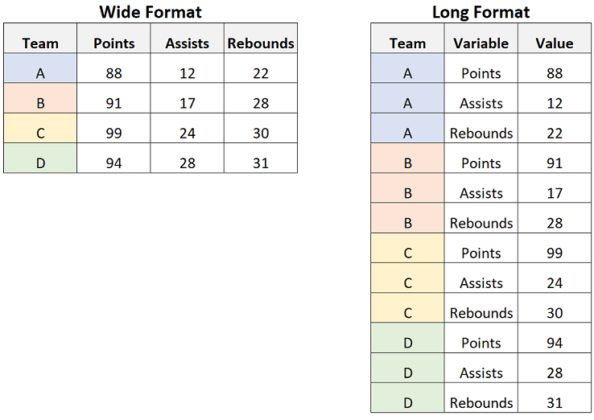

```{r setup, include=FALSE} 
#Set some Rmarkdown that will be used throughout.
knitr::opts_chunk$set(warning = FALSE, message = FALSE) 
```

# Introduction
In these notebooks I have tried to document most of the R-analyses I’ve done while in the lab of Hanno and Judith Steen. I myself was heavily focussed on the large-scale analysis of body-fluid samples, but the code provided should be applicable to other cross-sectional or longitudinal studies.

## Learning R
There is no easy way to learn R. It’s that simple. If you want to use the code I provide here you first need to get a basic understanding. Learning the basics is out of the scope of this documentation. Furthermore, multiple free classes exist online that can teach you the basics. Once you got the basics, come back and play with the provided code :).

## Learning the code provided here

Once you got the basics of R it would be ideal if you have a dataset you know and understand and already created some results out of. Take that one and apply the code here. You can of course just copy and paste and hope for the best, but its an even better idea to figure out why each step is done and what the result of each part of the code is and why it gives the result that is needed.


## Suggested online classes
Do these three courses on EDX (Free) and you can learn the basics.

- https://www.edx.org/course/data-science-r-basics
- https://www.edx.org/course/data-science-visualization
- https://www.edx.org/course/data-science-wrangling

Once you’re done, its a matter of keep using R for your analysis. Through trial and error + searching on Google/Stackoverflow + asking your colleagues you can get there.


# Import and Cleaning

Proteomics data from tools such as MSFragger or DIA-NN often comes in a .csv (comma-separated) or .tsv (tab-separated) format. First, we need to extract the information we actually want to use, versus the columns we do not care so much about.

```{r}
#import library
library(tidyverse)
library(ggpubr)
library(rstatix)
library(ggbeeswarm)
suppressPackageStartupMessages(library(ComplexHeatmap))
library(mixOmics)
library(umap)
library(package = "pvca") # devtools::install_github("dleelab/pvca")
library(clusterProfiler)
library(ggraph)
library(org.Hs.eg.db)
library(WebGestaltR)
library(ReactomePA)
library(enrichplot)
library(msigdbr)
library(WGCNA)
library(yardstick)
library(seqinr)
```


## Wide vs long (tidy) format.

In Excel it makes sense to store each sample in a seperate column. In R, however, this is highly annoying as you would have to specify the name of each sample. Instead, its easier to put it in a long format. The long format is commonly used in the so called "tidyverse", which is a very useful tool for statistics and visualization in R. 


```{r ssa-logo, fig.align = 'center', out.width = "50%", fig.cap = "Example of wide and long format"}


```

## Importing - MSFragger

MSFragger creates the following files:

- combined_protein.tsv
- combined_peptide.tsv
- combined_modified_peptide.tsv

We can import these through the script/function below.

### Protein - Level Data

Will need four inputs:

- The MSFragger combined_protein file
- If you want Intensity, Total, or Unique
- If you want the MaxLFQ or normal version of that?
- cut off (0 if none)

#### The function
```{r}
clean_combined_protein_fragger <- function(dataset, Intensity, MaxLFQ, cutoff){
  
  #change Protein name
  names(dataset)[names(dataset) == 'Protein ID'] <- 'ProteinID'
  
  #Select columns of interest
  dataset <- dplyr::mutate(dataset, Protein = paste0(ProteinID, "_", Gene))
  
  # Select the specified Intensity. 
  # We also start creating the substring we will remove from sample names.
  if (Intensity == "Intensity" || Intensity == "intensity"){
    dataset <- dplyr::select(dataset, Protein, contains("Intensity"), -contains("Total"), -contains("Unique"))
    removeSubString <- paste0(" ", "Intensity")
  } else if (Intensity == "Total" || Intensity == "total"){
    dataset <- dplyr::select(dataset, Protein, contains("Total Intensity"))
    removeSubString <- paste0(" ", "Total", " Intensity")
  } else if (Intensity == "Unique" || Intensity == "unique"){
    dataset <- dplyr::select(dataset, Protein, contains("Unique Intensity"))
    removeSubString <- paste0(" ", "Unique", " Intensity")
  } else {
    print("Something went wrong with selecting which Intensity. You sure you wrote it right? Choose from Total, Unique or Intensity")
  }
  
  #select or not select MaxLFQ
  if (MaxLFQ == "MaxLFQ" || MaxLFQ == "maxlfq" || MaxLFQ == "MAXLFQ" || MaxLFQ == "max lfq"){
    dataset <- dplyr::select(dataset, Protein, contains("MaxLFQ"))
    removeSubString <- paste0(" MaxLFQ", removeSubString)
  } else if(MaxLFQ == "None" || MaxLFQ == "none"){
    dataset <- dplyr::select(dataset, Protein, contains("Intensity"), -contains("MaxLFQ"))
  } else {
    print("Something went wrong. You have to write MaxLFQ or None(for no MAXLFQ selection)")
    print("Alternativly, you might have selected MaxLFQ but you used old version of Fragpipe (its been there since 17.0/17.1")
  }
  
  #col to rowname
  dataset <- tibble::column_to_rownames(dataset, "Protein")
  
  #Get rid of substring part we do not need
  colnames(dataset) <- stringr::str_remove(colnames(dataset), removeSubString)
  
  #transpose, remove zeros, log2
  dataset <- data.frame(t(dataset))
  dataset[dataset == 0] <- NA
  dataset <- log2(dataset)
  
  #apply cutoff on the protein level
  if (cutoff %in% 0:100){
    dataset <- purrr::discard(dataset, ~sum(is.na(.x))/length(.x)* 100 >= (100-cutoff))
  } else {
    print("You selected a cut off filter out of 0 until 100.....")
    print("Or maybe you wrote it as a string (if it has quotation marks around it)")
  }
  
  #Long Format it
  dataset <- tibble::rownames_to_column(dataset, "Sample")
  dataset <- tidyr::gather(dataset, colnames(dataset)[2:ncol(dataset)], key = "Protein", value = "Intensity") 

  return(dataset)
}
```

#### Usage
```{r, results='asis'}
cleanedDF <- clean_combined_protein_fragger(
  read_tsv("combined_protein.tsv"),
  Intensity = "Intensity", #You can choose others, such as Unique, Total, or just Intensity
  MaxLFQ = "None", #You can choose MaxLFQ or None
  cutoff = 0
)

knitr::kable(head(cleanedDF), caption = "Example of the Results", floating.environment="sidewaystable")
```


### peptide - Level Data without modifications

Will need four inputs:

- The MSFragger combined_peptide file
- If you want Intensity, Total, or Unique
- If you want the MaxLFQ or normal version of that?
- cut off (0 if none)

NOTE: Fragpipe sometimes changes the column names of result files.... Thus, you might have to adapt. For example, Sequence column got changed to 'peptide Sequence' leading to needing to adjust for that.

#### The function
```{r}

clean_combined_peptide_fragger <- function(dataset, Intensity, MaxLFQ, cutoff){
  

  #change Protein name
  names(dataset)[names(dataset) == 'Protein ID'] <- 'ProteinID'
  names(dataset)[names(dataset) == 'Peptide Sequence'] <- 'Sequence'

  #Select columns of interest
  dataset <- dplyr::mutate(dataset, Protein = paste0(ProteinID, "_", Gene, "_", Sequence))
  
  # Select the specified Intensity. 
  # We also start creating the substring we will remove from sample names.
  if (Intensity == "Intensity" || Intensity == "intensity"){
    dataset <- dplyr::select(dataset, Protein, contains("Intensity"), -contains("Total"), -contains("Unique"))
    removeSubString <- paste0(" ", "Intensity")
  } else if (Intensity == "Total" || Intensity == "total"){
    dataset <- dplyr::select(dataset, Protein, contains("Total Intensity"))
    removeSubString <- paste0(" ", "Total", " Intensity")
  } else if (Intensity == "Unique" || Intensity == "unique"){
    dataset <- dplyr::select(dataset, Protein, contains("Unique Intensity"))
    removeSubString <- paste0(" ", "Unique", " Intensity")
  } else {
    print("Something went wrong with selecting which Intensity. You sure you wrote it right? Choose from Total, Unique or Intensity")
  }
  
  #select or not select MaxLFQ
  if (MaxLFQ == "MaxLFQ" || MaxLFQ == "maxlfq" || MaxLFQ == "MAXLFQ" || MaxLFQ == "max lfq"){
    dataset <- dplyr::select(dataset, Protein, contains("MaxLFQ"))
    removeSubString <- paste0(" MaxLFQ", removeSubString)
  } else if(MaxLFQ == "None" || MaxLFQ == "none"){
    dataset <- dplyr::select(dataset, Protein, contains("Intensity"), -contains("MaxLFQ"))
  } else {
    print("Something went wrong. You have to write MaxLFQ or None(for no MAXLFQ selection)")
    print("Alternativly, you might have selected MaxLFQ but you used old version of Fragpipe (its been there since 17.0/17.1")
  }
  
  #col to rowname
  dataset <- tibble::column_to_rownames(dataset, "Protein")
  
  #Get rid of substring part we do not need
  colnames(dataset) <- stringr::str_remove(colnames(dataset), removeSubString)
  
  #transpose, remove zeros, log2
  dataset <- data.frame(t(dataset))
  dataset[dataset == 0] <- NA
  dataset <- log2(dataset)
  
  #apply cutoff on the protein level
  if (cutoff %in% 0:100){
    dataset <- purrr::discard(dataset, ~sum(is.na(.x))/length(.x)* 100 >= (100-cutoff))
  } else {
    print("You selected a cut off filter out of 0 until 100.....")
    print("Or maybe you wrote it as a string (if it has quotation marks around it)")
  }
  
  #Long Format it
  dataset <- tibble::rownames_to_column(dataset, "Sample")
  dataset <- tidyr::gather(dataset, colnames(dataset)[2:ncol(dataset)], key = "Protein", value = "Intensity") 
  
  return(dataset)
}
```

#### Usage
```{r}
cleanedDF <- clean_combined_peptide_fragger(
  read_tsv("combined_peptide.tsv"),
  Intensity = "Intensity", #You can choose others, such as Unique, Total, or just Intensity
  MaxLFQ = "None", #You can choose MaxLFQ or None
  cutoff = 0
)

knitr::kable(head(cleanedDF), caption = "Example of the Results", floating.environment="sidewaystable")
```

### peptide - Level Data WITH modifications

Will need four inputs:

- The MSFragger combined_modified_peptide file
- If you want Intensity, Total, or Unique
- If you want the MaxLFQ or normal version of that?
- cut off (0 if none)

NOTE: Fragpipe sometimes changes the column names of result files.... Thus, you might have to adapt. For example, Sequence column got changed to 'peptide Sequence' leading to needing to adjust for that.

#### The function
```{r}
clean_combined_modifiedpeptide_fragger <- function(dataset, Intensity, MaxLFQ, cutoff){
  

  #change Protein name
  names(dataset)[names(dataset) == 'Protein ID'] <- 'ProteinID'
  names(dataset)[names(dataset) == 'Modified Sequence'] <- 'ModifiedSequence'
  names(dataset)[names(dataset) == 'Prev AA'] <- 'PrevAA'
  names(dataset)[names(dataset) == 'Next AA'] <- 'NextAA'
  
  #Select columns of interest
  dataset <- dplyr::mutate(dataset, Protein = paste0(ProteinID, "_", Gene, "_", ModifiedSequence, "_", PrevAA, "_", NextAA))
  
  # Select the specified Intensity. 
  # We also start creating the substring we will remove from sample names.
  if (Intensity == "Intensity" || Intensity == "intensity"){
    dataset <- dplyr::select(dataset, Protein, contains("Intensity"), -contains("Total"), -contains("Unique"))
    removeSubString <- paste0(" ", "Intensity")
  } else if (Intensity == "Total" || Intensity == "total"){
    dataset <- dplyr::select(dataset, Protein, contains("Total Intensity"))
    removeSubString <- paste0(" ", "Total", " Intensity")
  } else if (Intensity == "Unique" || Intensity == "unique"){
    dataset <- dplyr::select(dataset, Protein, contains("Unique Intensity"))
    removeSubString <- paste0(" ", "Unique", " Intensity")
  } else {
    print("Something went wrong with selecting which Intensity. You sure you wrote it right? Choose from Total, Unique or Intensity")
  }
  
  #select or not select MaxLFQ
  if (MaxLFQ == "MaxLFQ" || MaxLFQ == "maxlfq" || MaxLFQ == "MAXLFQ" || MaxLFQ == "max lfq"){
    dataset <- dplyr::select(dataset, Protein, contains("MaxLFQ"))
    removeSubString <- paste0(" MaxLFQ", removeSubString)
  } else if(MaxLFQ == "None" || MaxLFQ == "none"){
    dataset <- dplyr::select(dataset, Protein, contains("Intensity"), -contains("MaxLFQ"))
  } else {
    print("Something went wrong. You have to write MaxLFQ or None(for no MAXLFQ selection)")
    print("Alternativly, you might have selected MaxLFQ but you used old version of Fragpipe (its been there since 17.0/17.1")
  }
  
  #col to rowname
  dataset <- tibble::column_to_rownames(dataset, "Protein")
  
  #Get rid of substring part we do not need
  colnames(dataset) <- stringr::str_remove(colnames(dataset), removeSubString)
  
  #transpose, remove zeros, log2
  dataset <- data.frame(t(dataset))
  dataset[dataset == 0] <- NA
  dataset <- log2(dataset)
  
  #apply cutoff on the protein level
  if (cutoff %in% 0:100){
    dataset <- purrr::discard(dataset, ~sum(is.na(.x))/length(.x)* 100 >= (100-cutoff))
  } else {
    print("You selected a cut off filter out of 0 until 100.....")
    print("Or maybe you wrote it as a string (if it has quotation marks around it)")
  }
  
  #Long Format it
  dataset <- tibble::rownames_to_column(dataset, "Sample")
  dataset <- tidyr::gather(dataset, colnames(dataset)[2:ncol(dataset)], key = "Protein", value = "Intensity") 
  
  return(dataset)
}
```

#### Usage

Hanno once wanted info on the amino-acid (AA) before and after the sequence. I added that to this function. It can be removed or adjusted in the function where you specify the columns you are interested in.

```{r}
cleanedDF <- clean_combined_modifiedpeptide_fragger(
  read_tsv("combined_modified_peptide.tsv"),
  Intensity = "Intensity", #You can choose others, such as Unique, Total, or just Intensity
  MaxLFQ = "None", #You can choose MaxLFQ or None
  cutoff = 0
)

knitr::kable(head(cleanedDF), caption = "Example of the Results", floating.environment="sidewaystable")
```

## Importing - DIA-NN

DIA-NN data comes in a slightly different format. Furthermore, it does not differentiate between a modified and non-modified peptide datafile.

- protein-groups file comes with a XXX.pg_matrix.tsv format
- the peptide-groups file comes with a XXX.pr_matrix.tsv format

Similair to Fragpipe output, we import and make some adjustments to put it in that long format again.

### Protein - Level Data


#### Function 

```{r}
#Functions to load in Protein Level DIA_NN dataframes
#Will need two inputs
# The DIA_NN <SOMETHING>.pg_matrix.tsv file
# cut off (0 if none)

clean_combined_protein_diann <- function(dataset, cutoff){
  
  #combine the ProteinGroup and Genes
  dataset <- dplyr::mutate(dataset, Protein = paste0(Protein.Group, "_", Genes))
  
  #Proteins to rownames
  dataset <- tibble::column_to_rownames(dataset, "Protein")
  
  #deselect the not-user stuff
  dataset <- dplyr::select(dataset, - Protein.Ids,- Protein.Names, - Genes, - First.Protein.Description, - Protein.Group)
  
  #Clean the Sample Names
  colnames(dataset) <- sapply(strsplit(colnames(dataset), "\\", fixed=TRUE), tail, 1)
  colnames(dataset) <- stringr::str_remove(colnames(dataset), ".d")
  
  #transpose, remove zeros, log2
  dataset <- data.frame(t(dataset))
  dataset[dataset == 0] <- NA
  dataset <- log2(dataset)
  
  #apply cutoff on the protein level
  if (cutoff %in% 0:100){
    dataset <- purrr::discard(dataset, ~sum(is.na(.x))/length(.x)* 100 >= (100-cutoff))
  } else {
    print("You selected a cut off filter out of 0 until 100.....")
    print("Or maybe you wrote it as a string (if it has quotation marks around it)")
  }
  
  #Long Format it
  dataset <- tibble::rownames_to_column(dataset, "Sample")
  dataset <- tidyr::gather(dataset, colnames(dataset)[2:ncol(dataset)], key = "Protein", value = "Intensity") 
  
  return(dataset)
  
}
```

#### Usage
```{r}
cleanedDF <- clean_combined_protein_diann(
  read_tsv("DIA.pg_matrix.tsv"),
  cutoff = 0
)

knitr::kable(head(cleanedDF), caption = "Example of the Results", floating.environment="sidewaystable")
```


### Peptide - Level Data

#### Function

```{r}
### PEPTIDE LEVEL
clean_combined_peptide_diann <- function(dataset, cutoff){
  
  #combine the ProteinGroup and Genes
  dataset <- dplyr::mutate(dataset, Protein = paste0(Protein.Group, "_", Genes, "_", Precursor.Id))
  
  #Proteins to rownames
  dataset <- tibble::column_to_rownames(dataset, "Protein")
  
  #deselect the not-user stuff
  dataset <- dplyr::select(dataset, - Protein.Group, - Protein.Names, - Proteotypic, - Stripped.Sequence, - Precursor.Charge, - Modified.Sequence, - First.Protein.Description, - Protein.Group, - Genes, - Precursor.Id, - Protein.Ids)
  
  #Clean the Sample Names
  colnames(dataset) <- sapply(strsplit(colnames(dataset), "\\", fixed=TRUE), tail, 1)
  colnames(dataset) <- stringr::str_remove(colnames(dataset), ".d")
  
  #transpose, remove zeros, log2
  dataset <- data.frame(t(dataset))
  dataset[dataset == 0] <- NA
  dataset <- log2(dataset)
  
  #apply cutoff on the protein level
  if (cutoff %in% 0:100){
    dataset <- purrr::discard(dataset, ~sum(is.na(.x))/length(.x)* 100 >= (100-cutoff))
  } else {
    print("You selected a cut off filter out of 0 until 100.....")
    print("Or maybe you wrote it as a string (if it has quotation marks around it)")
  }
  
  #Long Format it
  dataset <- tibble::rownames_to_column(dataset, "Sample")
  dataset <- tidyr::gather(dataset, colnames(dataset)[2:ncol(dataset)], key = "Protein", value = "Intensity") 
  
  return(dataset)
  
}
```

#### Usage
```{r}
cleanedDF <- clean_combined_peptide_diann(
  read_tsv("DIA.pr_matrix.tsv"),
  cutoff = 0
)

knitr::kable(head(cleanedDF), caption = "Example of the Results", floating.environment="sidewaystable")
```


# Outlier Removal

### Import DF for outlier and normalization

```{r}
#We load in a long format as described in chapter 1. 
exampleDF <- read_csv("exampleDF.csv")
```

Hanno (Steen) and I developed this method once to select outliers. The following steps are done:

1. For each protein in the dataset, calculate the median. Thus we create an 'additional sample' which is composed of all median values.
2. Correlate each sample to this created median-sample
3. We calculate the standard deviation of all these correlations
4. We multiply this standard deviation based on how strict we want it. If a sample is x standard deviations away, we consider it an outlier.

This function therefore requires the dataset, the standard deviation strictness and a name since it will also plot (PCA) the data.

### Function

```{r}

OutlierRemover <- function(dataset, Stdv, name){
  
  #Determine correlations between sample and theoretical
  SampleCorrelations <- dataset%>%
    group_by(Protein) %>%
    dplyr::mutate(medianProtein = median(Intensity, na.rm = T)) %>%
    ungroup() %>%
    group_by(Sample) %>%
    dplyr::mutate(SampleCor = stats::cor(Intensity, medianProtein, method = "pearson", use="pairwise.complete.obs")) %>%
    ungroup() %>%
    distinct(Sample, .keep_all = T)
  
  SampleCorrelations <- SampleCorrelations %>%
    dplyr::mutate(Outlier = SampleCor < (1 - Stdv*sd(unique(SampleCorrelations$SampleCor), na.rm = T)))
  
  #Make the DF that we will return (i.e. without outliers)
  returnDataset <- dataset %>%
    dplyr::filter(Sample %in% dplyr::filter(SampleCorrelations, Outlier == F)$Sample) %>%
    dplyr::select(Protein, Sample, Intensity)  
  
  #Purely for visualization: Also attached PCA Plots of the removed samples
  
  #Half minimum value (per protein) imputation
  PCA_DF <- dataset %>% 
    group_by(Protein) %>%
    dplyr::mutate(IntensImputed = replace_na(Intensity, mean(Intensity, na.rm = T)/2)) %>%
    dplyr::select(Protein, Sample, IntensImputed) %>%
    spread(key = "Protein", value = "IntensImputed") %>%
    column_to_rownames("Sample")
  
  #scale and PCA
  PCA_DF_Results <- prcomp(scale(as.matrix(PCA_DF)))
  eigs <- PCA_DF_Results$sdev^2
  variance_percentage <- (eigs / sum(eigs))*100
  pc1var <- round(variance_percentage[1],digits=0)
  pc2var <- round(variance_percentage[2],digits=0)
  
  #Plot
  plot(left_join(SampleCorrelations, rownames_to_column(data.frame(PCA_DF_Results$x)), by = c("Sample" = "rowname")) %>%
         ggplot(aes(x = PC1, y = PC2, colour = Outlier, shape = Outlier)) +
         geom_point(size = 2.5, alpha = 0.6) +
         theme_bw() +
         xlab(paste('PC1',' (',pc1var,'% variance)',sep='')) +
         ylab(paste('PC2',' (',pc2var,'% variance)',sep='')) +
         scale_color_manual(values = c("black", "red")) +
         ggtitle(name))
  
  #Print and Return
  print(paste("The following were removed from:", name, toString(dplyr::filter(SampleCorrelations, Outlier == T)$Sample)))
  return(returnDataset)
}
```

### Usage

```{r}
example_without_outliers <- OutlierRemover(
  exampleDF,
  Stdv = 3, 
  name = "Example Outlier Removal"
)
```


# Normalization

I've made a few normalization methods. Here I describe each of them.

## Normalize - based on pool

In house made normalization method on pool samples. 

1. Determine the median per pooled sample
2. If multiple, determine the median of these medians
3. For each non-pool sample calculate the median
4. Determine what factor needs to be applied to normalize it to the median-pool one
5. Apply this factor

```{r}
#Based on the pool. Requires user to give string_of_pool with ONE systematic naming convention.
normalize_basedonpool <- function(dataset, string_of_pool){
  
  #First calculate per sample the median intensity.
  #Then take the mean of all those medians.
  dataset_references <- 
    dataset %>%
    mutate(Intensity = 2^Intensity)%>%
    dplyr::filter(grepl(string_of_pool, Sample)) %>%
    group_by(Sample) %>%
    summarise(PerSampleMedian = median(Intensity, na.rm = TRUE)) %>%
    ungroup() %>%
    summarise(AverageMedian = mean(PerSampleMedian))
  
  
  #Only select samples, calculate median per sample.
  #Determine per sample normalization factor
  #apply it to intensity column. 
  #clean up.
  dataset_noreferences <- 
    dataset %>%
    mutate(Intensity = 2^Intensity)%>%
    dplyr::filter(!grepl(string_of_pool, Sample)) %>%
    group_by(Sample) %>%
    mutate(PerSampleMedian = median(Intensity, na.rm = TRUE)) %>%
    mutate(NormalizeFactor = dataset_references[[1,1]]/ PerSampleMedian) %>%
    mutate(Intensity = Intensity * NormalizeFactor) %>%
    ungroup() %>%
    mutate(Intensity = log2(Intensity)) %>%
    dplyr::select(Protein, Sample, Intensity)
  
  boxplot_before <- 
    dataset %>%
    dplyr::filter(!grepl(string_of_pool, Sample)) %>%
    ggplot(aes(x = Sample, y = Intensity)) +
    geom_boxplot() +
    theme_bw() +
    theme(axis.ticks.x = element_blank(), axis.text.x = element_blank()) +
    ggtitle("before Normalization") +
    ylab("log2(Intensity)")
  
  boxplot_after <- 
    dataset_noreferences %>%
    ggplot(aes(x = Sample, y = Intensity)) +
    geom_boxplot() +
    theme_bw() +
    theme(axis.ticks.x = element_blank(), axis.text.x = element_blank()) +
    ggtitle("after Normalization") +
    ylab("log2(Intensity)")
  
  plot(ggarrange(boxplot_before, boxplot_after, nrow = 1))
  
  return(dataset_noreferences)
}
```

### Usage

```{r}
example_without_outliers_normalized_pool <- normalize_basedonpool(example_without_outliers, string_of_pool = "Pool")
```


## Normalize - summed intensity

Normalize by calculating median of all summed intensities. Normalize to per sample sum.


```{r}
#User can also remove pool (standard = "")

normalize_summedintensity <- function(dataset, string_of_pool = ""){
  
  dataset_medianSummedIntensity <- dataset %>%
    mutate_all(~replace(., . == 0, NA)) %>%
    mutate(Intensity = 2^Intensity)%>%
    group_by(Sample) %>%
    summarise(PerSampleSum = sum(Intensity, na.rm = TRUE)) %>%
    ungroup() %>%
    summarise(medianOfSummedIntensities = median(PerSampleSum))
  
  if (string_of_pool != ""){
    print("Info on Pools were included. They are used to determine summed Intensity but removed downstream.")
    dataset <- dataset %>%
      dplyr::filter(!grepl(string_of_pool, Sample))
  }
  
  dataset_normalized <-   
    dataset %>%
    mutate(Intensity = 2^Intensity) %>%
    group_by(Sample) %>%
    mutate(PerSampleSum = sum(Intensity, na.rm = TRUE)) %>%
    mutate(NormalizeFactor = dataset_medianSummedIntensity[[1,1]]/ PerSampleSum) %>%
    mutate(Intensity = Intensity * NormalizeFactor) %>%
    ungroup() %>%
    dplyr::select(Protein, Sample, Intensity) %>%
    mutate_all(~replace(., . == 0, NA)) %>%
    mutate(Intensity = log2(Intensity))
  
  boxplot_before <- 
    dataset %>%
    ggplot(aes(x = Sample, y = Intensity)) +
    geom_boxplot() +
    theme_bw() +
    theme(axis.ticks.x = element_blank(), axis.text.x = element_blank()) +
    ggtitle("before Normalization") +
    ylab("log2(Intensity)")
  
  boxplot_after <- 
    dataset_normalized %>%
    ggplot(aes(x = Sample, y = Intensity)) +
    geom_boxplot() +
    theme_bw() +
    theme(axis.ticks.x = element_blank(), axis.text.x = element_blank()) +
    ggtitle("before Normalization") +
    ylab("log2(Intensity)")
  
  plot(ggarrange(boxplot_before, boxplot_after, nrow = 1))
  
  return(dataset_normalized)
}
```

### Usage

```{r}
example_without_outliers_normalized_summedIntens_withPool <- normalize_summedintensity(example_without_outliers, string_of_pool = "Pool")

#OR if you do not have pool dont specify and it wont delete them.

example_without_outliers_normalized_summedIntens_withPool <- normalize_summedintensity(example_without_outliers)
```

## Normalize - Median Intensity

Normalize by calculating median of all summed intensities. Normalize to per sample median.


```{r}
#User can also remove pool (standard = "")

normalize_medianintensity <- function(dataset, string_of_pool = ""){
  
  dataset_medianSummedIntensity <- dataset %>%
    mutate_all(~replace(., . == 0, NA)) %>%
    mutate(Intensity = 2^Intensity)%>%
    group_by(Sample) %>%
    summarise(PerSampleSum = median(Intensity, na.rm = TRUE)) %>%
    ungroup() %>%
    summarise(medianOfSummedIntensities = median(PerSampleSum))
  
  if (string_of_pool != ""){
    print("Info on Pools were included. They are used to determine summed Intensity but removed downstream.")
    dataset <- dataset %>%
      dplyr::filter(!grepl(string_of_pool, Sample))
  }
  
  dataset_normalized <-   
    dataset %>%
    mutate(Intensity = 2^Intensity) %>%
    group_by(Sample) %>%
    mutate(PerSampleSum = median(Intensity, na.rm = TRUE)) %>%
    mutate(NormalizeFactor = dataset_medianSummedIntensity[[1,1]]/ PerSampleSum) %>%
    mutate(Intensity = Intensity * NormalizeFactor) %>%
    ungroup() %>%
    dplyr::select(Protein, Sample, Intensity) %>%
    mutate_all(~replace(., . == 0, NA)) %>%
    mutate(Intensity = log2(Intensity))
  
  boxplot_before <- 
    dataset %>%
    ggplot(aes(x = Sample, y = Intensity)) +
    geom_boxplot() +
    theme_bw() +
    theme(axis.ticks.x = element_blank(), axis.text.x = element_blank()) +
    ggtitle("before Normalization") +
    ylab("log2(Intensity)")
  
  boxplot_after <- 
    dataset_normalized %>%
    ggplot(aes(x = Sample, y = Intensity)) +
    geom_boxplot() +
    theme_bw() +
    theme(axis.ticks.x = element_blank(), axis.text.x = element_blank()) +
    ggtitle("before Normalization") +
    ylab("log2(Intensity)")
  
  plot(ggarrange(boxplot_before, boxplot_after, nrow = 1))
  
  return(dataset_normalized)
}
```

### Usage

```{r}
example_without_outliers_normalized_medianIntens_withPool <- normalize_medianintensity(example_without_outliers, string_of_pool = "Pool")

#OR if you do not have pool dont specify and it wont delete them.

example_without_outliers_normalized_medianIntens_withPool <- normalize_medianintensity(example_without_outliers)
```


## Normalize - VSN

- VSN normalization. Assumed log2 transformed data.
- check the following DOI: doi: 10.1093/bib/bbw095

```{r}
#VSN normalization. Assumed log2 transformed data.
#check the following DOI
# doi: 10.1093/bib/bbw095

normalize_vsn <- function(dataset, string_of_pool = ""){
  
  if (string_of_pool != ""){
    print("Info on Pools were included. They are used to determine summed Intensity but removed downstream.")
    dataset <- dataset %>%
      dplyr::filter(!grepl(string_of_pool, Sample))
  }
  
  RawMatrix <- dataset %>%
    mutate(Intensity = 2^Intensity) %>%
    spread(Protein, Intensity) %>%
    column_to_rownames("Sample")
  
  normMatrix <- data.frame(suppressMessages(vsn::justvsn(as.matrix(RawMatrix), ))) %>%
    rownames_to_column(var = "Sample") 
  
  dataset_normalized <- tidyr::gather(normMatrix, colnames(normMatrix)[2:ncol(normMatrix)], key = "Protein", value = "Intensity") 
  
  boxplot_before <- 
    dataset %>%
    ggplot(aes(x = Sample, y = Intensity)) +
    geom_boxplot() +
    theme_bw() +
    theme(axis.ticks.x = element_blank(), axis.text.x = element_blank()) +
    ggtitle("before Normalization") +
    ylab("log2(Intensity)")
  
  boxplot_after <- 
    dataset_normalized %>%
    ggplot(aes(x = Sample, y = Intensity)) +
    geom_boxplot() +
    theme_bw() +
    theme(axis.ticks.x = element_blank(), axis.text.x = element_blank()) +
    ggtitle("before Normalization") +
    ylab("log2(Intensity)")
  
  plot(ggarrange(boxplot_before, boxplot_after, nrow = 1))
  
  return(dataset_normalized)
  
}
```


```{r}
example_without_outliers_normalized_vsnIntens_withPool <- normalize_vsn(example_without_outliers, string_of_pool = "Pool")

#OR if you do not have pool dont specify and it wont delete them.

example_without_outliers_normalized_vsnIntens_withPool <- normalize_vsn(example_without_outliers)
```


### Usage

## Normalize - LOESS

- LOESS normalization. Assumed log2 transformed data.
- check the following DOI: doi: 10.1093/bib/bbw095

```{r}
normalize_loess <- function(dataset, string_of_pool = ""){
  
  if (string_of_pool != ""){
    print("Info on Pools were included. They are used to determine summed Intensity but removed downstream.")
    dataset <- dataset %>%
      dplyr::filter(!grepl(string_of_pool, Sample))
  }
  
  RawMatrix <- dataset %>%
    mutate_all(~replace(., . == 0, NA)) %>%
    spread(Protein, Intensity) %>%
    column_to_rownames("Sample")
  
  normMatrix <- data.frame(limma::normalizeCyclicLoess(as.matrix(RawMatrix), method="fast")) %>%
    rownames_to_column(var = "Sample") 
  
  dataset_normalized <- tidyr::gather(normMatrix, colnames(normMatrix)[2:ncol(normMatrix)], key = "Protein", value = "Intensity") 
  
  boxplot_before <- 
    dataset %>%
    ggplot(aes(x = Sample, y = Intensity)) +
    geom_boxplot() +
    theme_bw() +
    theme(axis.ticks.x = element_blank(), axis.text.x = element_blank()) +
    ggtitle("before Normalization") +
    ylab("log2(Intensity)")
  
  boxplot_after <- 
    dataset_normalized %>%
    ggplot(aes(x = Sample, y = Intensity)) +
    geom_boxplot() +
    theme_bw() +
    theme(axis.ticks.x = element_blank(), axis.text.x = element_blank()) +
    ggtitle("before Normalization") +
    ylab("log2(Intensity)")
  
  plot(ggarrange(boxplot_before, boxplot_after, nrow = 1))
  
  return(dataset_normalized)
}

```

### Usage

```{r}
example_without_outliers_normalized_loessIntens_withPool <- normalize_loess(example_without_outliers, string_of_pool = "Pool")

#OR if you do not have pool dont specify and it wont delete them.

example_without_outliers_normalized_loessIntens_withPool <- normalize_loess(example_without_outliers)
```


# Combine with Clinical

This is a tricky part. Not because the R-code is complicated, but because clinical data comes in all sizes and shapes.

Inside your clinical data file (preferably a CSV) you want:

- COLUMN with same sample names as in Fragpipe/DIA-NN output
- Any additional clinical column


```{r}
postOutlierAndNormal <- read_csv("postOutlierAndNormal.csv")
```
## Import the Clinical file

First we import the clinical. Since the sampleID is full of numbers R thinks its numbers, but we want it to be characters. Lets also change that here.

For visualization the table1-package is straightforward to use. Below a small example, but of course more info can be found on:

https://cran.r-project.org/web/packages/table1/vignettes/table1-examples.html


```{r}
library(table1)

clinical_data <- read_csv("Clinical.csv")

clinical_data <- clinical_data %>%
  mutate(SampleID = as.character(SampleID))

table1::table1(~ DX + Fake_Age | DX, data = clinical_data)
```

# Ttest And Anova

## Imports

To do these statistics, we use the:

- R-statix package for statistics tests
- ggebeeswarm to pimp boxplot
- ggpubr for post-hoc analysis WITHIN the visualization
- complexheatmap for.... Heatmaps
- tidyverse for all else

```{r}
clinical_and_protein_joined <- read_csv("clinicalAndProtein.csv") 
```
### Filtering

#### Filter - XX% cut off

When you have a small number of samples its wise to apply a 50 or 70% cut off. Doing so, you reduce the number of proteins you include which helps your multiple testing comparison later on.

```{r}
clinical_and_protein_joined_90prct <- clinical_and_protein_joined %>% 
  mutate(uniqueSamplesInDF = length(unique(SampleID))) %>%
  group_by(Protein) %>%
  mutate(countMissingValues = sum(!is.na(Intensity))) %>%
  mutate(percentageMissing = countMissingValues / uniqueSamplesInDF) %>%
  filter(percentageMissing > 0.90) %>% # HERE YOU CAN APPLY THE CUT OFF! Here I do 70%
  dplyr::select(SampleID, DX, Fake_Age, Protein, Intensity) #clean up by selecting the original columns
```

#### Filter - Keep all that have at least two quantifications

In some cases it can be interesting to do an T-test/ANOVA on all proteins possible. To do so, we filter out protein that have less than 2 quantifications PER GROUP!!

```{r}
clinical_and_protein_joined_possible <- clinical_and_protein_joined %>%
  
  #Here its important that we remove any clinical factor. Thus we only select the columns we really need!
  dplyr::select(SampleID, DX, Protein, Intensity) %>%
  
  #First we spread (i.e. back to Wide format, but instead by clinical group)
  spread(DX, Intensity) %>%
  group_by(Protein) %>%
  
  #Here you need to specify each of the clinical groups you got.
  summarise(Disease_1 = sum(!is.na(Disease_1)),
            Disease_2 = sum(!is.na(Disease_2)),
            disease_3 = sum(!is.na(disease_3)),
            Control_1 = sum(!is.na(Control_1))) %>%
  
  #Create a column where we say that all values need at least 2 to be considered for the statistical test.
  mutate(possible = ifelse(Disease_1 < 2 | Disease_2 < 2 | disease_3 < 2 | Control_1 < 2, FALSE, TRUE)) %>%
  filter(possible)

#Now we filter for the proteins we have selected above
clinical_and_protein_joined_atLeastTwo <- clinical_and_protein_joined %>%
  filter(Protein %in% clinical_and_protein_joined_possible$Protein)
```


## T-test

### Running T-test

T-test tests based on two groups. We need to filter to select two first before running

```{r}
# I use the 90% cut off as an example. You can use any. Just be sure that when using 50% for example you might run into issues if you have four groups and you only use two for the T-test.
ttest_results <- clinical_and_protein_joined_90prct %>%
  
  #Filter the groups
  filter(DX %in% c("Disease_1", "Control_1")) %>%
  
  #Run the T-test and adjustments
  group_by(Protein) %>%
  t_test(Intensity ~ DX, detailed = T) %>%
  adjust_pvalue(method = "BH") %>%
  
  #Split the Protein name in Uniprot and Gene
  separate(Protein, c("UniprotID", "Gene")) %>%
  
  #Determine Fold change. Since we work with log-transformed values we can just substract
  mutate(FC = estimate1 - estimate2) %>%
  
  #Create log10 p-vals
  mutate(log10adjustP = -1*log10(p.adj)) %>%
  
  #Determine if up or down regulated
  mutate(Direction = ifelse(p.adj > 0.05, "NotSignificant", ifelse(FC < 0, "Down", "Up")))


#NON PARAMETRIC VERSION
mannWhitney_test <- clinical_and_protein_joined_90prct %>%
  
  #Filter the groups
  filter(DX %in% c("Disease_1", "Control_1")) %>%
  
  #Run the T-test and adjustments
  group_by(Protein) %>%
  wilcox_test(Intensity ~ DX, detailed = T) %>%
  adjust_pvalue(method = "BH") %>%
  
  #Split the Protein name in Uniprot and Gene
  separate(Protein, c("UniprotID", "Gene")) %>%
  
  #In the mann-whitney they already calculate the estimated differences, which for us is FC.
  mutate(FC = estimate) %>%
  
  #Create log10 p-vals
  mutate(log10adjustP = -1*log10(p.adj)) %>%
  
  #Determine if up or down regulated
  mutate(Direction = ifelse(p.adj > 0.05, "NotSignificant", ifelse(FC < 0, "Down", "Up")))
```

#### Visualization - VolcanoPlot

For plotting data ggplot2 (included in tidyverse) is the best thing ever.

We specify what our X, y and colouring(fill) variables are. From there on, we can pimp it up to our liking.

```{r}
ttest_results %>%
  ggplot(aes(x = estimate, y = log10adjustP, fill = Direction)) +
  geom_point(size = 3.5, shape = 21) +
  scale_fill_manual(values = c("#164db5", "darkgrey", "#d90429")) +
  theme_bw() +
  geom_hline(yintercept = 1.3, linetype = 2, alpha = 0.7) +
  xlab("Coefficient") +
  ylab("-log10(adjusted p-value)") +
  theme(legend.position= "none",
        panel.grid.major = element_blank(),
        panel.grid.minor = element_blank())
```


#### Visualization - Boxplot
 
Sometimes you want to plot one or a few specific proteins. If we look at the results dataframe we see that the proteins Q14767_LTBP2 and Q15113_PCOLCE are most significant. Lets plot these.

```{r}
clinical_and_protein_joined %>%
  
  #filter the original two groups, the two proteins and split the proteinnames again.
  filter(DX %in% c("Disease_1", "Control_1")) %>%
  filter(Protein %in% c("Q14767_LTBP2", "Q15113_PCOLCE")) %>%
  separate(Protein, c("UniprotID", "Gene")) %>%
  
  #Create the plot
  ggplot(aes(x = DX, y = Intensity, fill = DX)) +
  geom_boxplot() +
  geom_beeswarm(cex = 3, size = 1, color = "black") + #ADDS THE BLACK DOTS TO HELP INTERPRET THE DATA
  scale_fill_manual(values = c("Control_1" =  "darkgrey", "Disease_1" = "lightgreen")) +
  theme_bw() +
  
  #Split the plots by Gene. If we dont it will combine them which we do NOT want!!!!
  facet_wrap(~Gene)
```


## ANOVA

### Running ANOVA

Similar to T-test we use Rstatix anova_test to do the actual testing.

If it prints these "Coefficient covariances computed by hccm()" things, update Rstatix to 0.7.1 or higher.

```{r}
anova_results <- clinical_and_protein_joined_atLeastTwo %>%
  drop_na(Intensity) %>%
  group_by(Protein) %>%
  anova_test(Intensity ~ DX, detailed = T) %>%
  adjust_pvalue(method = "BH") %>%  
  separate(Protein, into = c("Uniprot", "Gene"), sep = "_", remove = F)
```


#### Visualization - Boxplot

Same thing as above, but now we do not filter for clinical groups.

We take the same proteins as above again.

Additionally, we can add post-hoc analysis. You might have to play a bit with the y-axis limits to make it fit!!

```{r}
#We need to specify which comparisons we want post-hoc to do.
my_comparisons <- list(
  c("Disease_1", "Disease_2"),
  c("Disease_1", "disease_3"),
  c("Disease_1", "Control_1"),
  c("Disease_2", "disease_3"),
  c("Disease_2", "Control_1"),
  c("disease_3", "Control_1")
  )


clinical_and_protein_joined_atLeastTwo %>%
  filter(Protein %in% c("Q14767_LTBP2", "Q15113_PCOLCE")) %>%
  
  #Z-score per protein. You can remove this if you want. Its can be nicer because you will have similar y-values
  group_by(Protein) %>%
  mutate(Zscore = scale(Intensity)) %>%
  
  #Clean so that you only Gene
  separate(Protein, c("Uniprot", "Gene")) %>%
  
  #plot
  ggplot(aes(x = DX, y = Zscore, fill = DX)) +
  geom_boxplot() +
  geom_beeswarm(cex = 3, size = 1, color = "black") +
  stat_compare_means(comparisons = my_comparisons) +
  scale_fill_manual(values = c("lightgrey", "lightgreen", "darkblue", "darkred")) +
  xlab("") +
  ylab("Z-scored Intensity") +
  facet_wrap(~Gene) +
  theme_bw() +
  theme(
    axis.title.x=element_blank(),
    axis.text.x=element_blank(),
    axis.ticks.x=element_blank(),
    panel.grid.major = element_blank(),
    panel.grid.minor = element_blank())
```

#### Visualization - Heatmap

Sometimes its nicer to plot ALL significant proteins in a heatmap. We can do that using the ComplexHeatmap Package.

For the heatmap we need a WIDE format dataframe, not a long(tidy) format. Its likely one of the few cases where wide is needed. Furthermore, we need a separate dataframe for the clinical values, and one for the protein info.

```{r}
#Filter for significant proteins, remove all clinical.
heatmap_wideDF_protein <- clinical_and_protein_joined_atLeastTwo %>%
  filter(Protein %in% 
           filter(anova_results, p.adj < 0.05)$Protein) %>%
  group_by(Protein) %>%
  mutate(Intensity = scale(Intensity)) %>%
  ungroup() %>%
  spread(key = "Protein", 
         value = "Intensity") %>%
  dplyr::select(-SampleID, -DX, -Fake_Age) 

#If you want the clinical variables on top (as we do here) you also need to put the sample names as columns. Thus we transpose.
heatmap_wideDF_protein <- data.frame(t(heatmap_wideDF_protein))

#filter for significant proteins, keep only clinical
heatmap_wideDF_clinical <- clinical_and_protein_joined_atLeastTwo %>%
  filter(Protein %in% 
           filter(anova_results, p.adj < 0.05)$Protein) %>%
  spread(key = "Protein", 
         value = "Intensity") %>%
  dplyr::select(SampleID, DX, Fake_Age)

#Make the annotation (i.e. clinical variable info) for the Heatmap
heatmap_clinical_info <- HeatmapAnnotation(
  Age = anno_points(heatmap_wideDF_clinical$Fake_Age),
  DX = heatmap_wideDF_clinical$DX,
  col = list( #IN HERE WE SPECIFY COLOURS. THIS IS CURRENTLY ONLY RELEVANT FOR DISEASE!
    DX = c("Disease_1" = "lightgreen",
           "Disease_2" = "darkblue",
           "disease_3" = "darkred",
           "Control_1" = "lightgrey")
  )
)

#make the Heatmap
Heatmap(
  as.matrix(heatmap_wideDF_protein),
  
  #Specify some things. You can look up the package for whatever you want to change
  column_title_rot = 90,
  column_title_gp = gpar(fontsize=10),
  
  show_column_names = F,
  show_row_names = F,
  border_gp = gpar(col = "black", lwd = 1),
  top_annotation = heatmap_clinical_info
  )
```


# Clustering

Different types of clustering will be discussed here, including:

- PCA
- UMAP
- PLSDA
- PVCA

We do not do tSNE because it is:

1. Very tricky in R as it does not keep original sample names (i.e. becomes a mess)
2. Every plot is different, so not reproducible at all.


But first, we briefly talk about imputation.

## Library and import
```{r}
VarCorr <- lme4::VarCorr #install.packages("lme4")

#import the Data
clinical_and_protein_joined <- read_csv("clinicalAndProtein.csv") 
clinical_only <- read_csv("clinical.csv")
```


## Imputation

When we impute we want to do it on proteins that do not have too many missing values. Commonly, you do a cut off (50% or more) followed by imputation. We often impute by zero or by half the minimum value for a given protein. Lets make data frames for each of these.

#### Prepare the cut off

I do 70% cut off here.

```{r}
clinical_and_protein_joined_70prct <- clinical_and_protein_joined %>% 
  mutate(uniqueSamplesInDF = length(unique(SampleID))) %>%
  group_by(Protein) %>%
  mutate(countMissingValues = sum(!is.na(Intensity))) %>%
  mutate(percentageMissing = countMissingValues / uniqueSamplesInDF) %>%
  filter(percentageMissing > 0.70) %>% # HERE YOU CAN APPLY THE CUT OFF! Here I do 70%
  dplyr::select(SampleID, DX, Fake_Age, Protein, Intensity) #clean up by selecting the original columns
```

#### Fill missing with 0

This one is very straightforward. Any NA will be filled with 0.

We also apply a Z-score AFTER the imputation.

```{r}
#Make a copy
clinical_and_protein_joined_70prct_imputezero <- clinical_and_protein_joined_70prct

#fill with 0 where is.na
clinical_and_protein_joined_70prct_imputezero$Intensity[is.na(clinical_and_protein_joined_70prct_imputezero$Intensity)] <- 0

#Z-score
clinical_and_protein_joined_70prct_imputezero <- clinical_and_protein_joined_70prct_imputezero %>%
  
  #Zscore per protein
  group_by(Protein) %>%
  mutate(Zscore = scale(Intensity)[,1]) %>%
  ungroup() %>%
  
    #Select only column we want to keep
  dplyr::select(SampleID, DX, Fake_Age, Protein, Zscore)
```

#### Fill Missing with half minimum PER protein

Here for each protein in the DF, we determine half the minimum value, and impute with that.

```{r}
clinical_and_protein_joined_70prct_imputehalfmin <- clinical_and_protein_joined_70prct %>%
  
  #Make a temporary column with half the minimum value per protein
  group_by(Protein) %>%
  mutate(halfMin = min(Intensity, na.rm = T)) %>%
  ungroup() %>%
  
  #Check if there is a NA, if yes fill. Otherwise fill with original.
  mutate(Imputed = ifelse(is.na(Intensity), halfMin, Intensity)) %>%
  
  #Apply Zscore again.
  group_by(Protein) %>%
  mutate(Zscore = scale(Imputed)[,1]) %>%
  ungroup() %>%
  
  #Select only column we want to keep
  dplyr::select(SampleID, DX, Fake_Age, Protein, Zscore)
```


## PCA

PCA is one of the most classical clustering methods for proteomics. Its an unbiased clustering approach. regular PCA can not handle missing values, so imputation is required making it sometimes tricky. there is a R-package can do it without. 

I will run on the two imputed dataframes, as well as the un-imputed one. We use the mixOmics package.

#### PCA - imputed halfmin
 
The data needs to be provided in a WIDE format, with ONLY the protein quant info!

```{r}
prepare_pca_imputehalf <- clinical_and_protein_joined_70prct_imputehalfmin %>%
  
  #Select the three columns we need. apply WIDE format. Move SampleID into rownames
  dplyr::select(SampleID, Protein, Zscore) %>%
  spread(key = Protein, value = Zscore) %>%
  column_to_rownames("SampleID")

#Run the PCA
pca_imputehalfmin <- mixOmics::pca(prepare_pca_imputehalf,
                                   ncomp =2, #With this one, we can limit the number of components. If you need more, just up it.
                                   center = F #NOTE: THIS DETERMINES IF THE FUNCTION NEEDS TO Zscore. WE ALREADY DID THAT BEFORE!!
                                   )
```

For plotting we need to extract:

 1. The PCA-Location info
 2. The PCA proportion values

Its again easy to extract these PCA-location datapoints, re-connect it to the clinical and THEN use ggplot for visualization.

```{r}
#Extract. This is a bit trickly. No easy way around it; you just have to play with data and try things out.
pca_imputehalfmin_location <- data.frame(pca_imputehalfmin$variates$X) %>%
  
  #Get the samplenames again. Make them numeric.
  rownames_to_column(var = "SampleID") %>%
  mutate(SampleID = as.numeric(SampleID)) %>%
  
  #join with the clinical data.
  right_join(clinical_only,
             by = c("SampleID" = "SampleID"))

#Plot!
pca_imputehalfmin_location %>%
  
  ##ggplot, size of dots three to make it easier to read.
  ggplot(aes(x = PC1, y = PC2, color = DX)) +
  geom_point(size = 3) +

  #theme and colouring
  theme_bw() +
  scale_color_manual(values = c("lightgrey", "lightgreen", "darkblue", "darkred")) +
  
  #Set the component percentages. We extract this as well from the PCA results.
  #Note again its a bit tricky.... Trial and error gets you there!
  #NOTE2: the value we extract needs to be multiplied by 100 for percentage.
  xlab(paste0("PC1 ", 100*round(pca_imputehalfmin$prop_expl_var[[1]][1], 2), "%")) +
  ylab(paste0("PC2 ", 100*round(pca_imputehalfmin$prop_expl_var[[1]][2], 2), "%")) +
  
  ggtitle("PCA with imputation using half minimum value per protein")
```

#### PCA - imputed 0
 
The data needs to be provided in a WIDE format, with ONLY the protein quant info!

```{r}
prepare_pca_imputezero <- clinical_and_protein_joined_70prct_imputezero %>%
  
  #Select the three columns we need. apply WIDE format. Move SampleID into rownames
  dplyr::select(SampleID, Protein, Zscore) %>%
  spread(key = Protein, value = Zscore) %>%
  column_to_rownames("SampleID")

#Run the PCA
pca_imputezero <- mixOmics::pca(prepare_pca_imputezero,
                                   ncomp =2, #With this one, we can limit the number of components. If you need more, just up it.
                                   center = F #NOTE: THIS DETERMINES IF THE FUNCTION NEEDS TO Zscore. WE ALREADY DID THAT BEFORE!!
                                   )
```

For plotting we need to extract:

 1. The PCA-Location info
 2. The PCA proportion values

Its again easy to extract these PCA-location datapoints, re-connect it to the clinical and THEN use ggplot for visualization.

```{r}
#Extract. This is a bit trickly. No easy way around it; you just have to play with data and try things out.
pca_imputezero_location <- data.frame(pca_imputezero$variates$X) %>%
  
  #Get the samplenames again. Make them numeric.
  rownames_to_column(var = "SampleID") %>%
  mutate(SampleID = as.numeric(SampleID)) %>%
  
  #join with the clinical data.
  right_join(clinical_only,
             by = c("SampleID" = "SampleID"))

#Plot!
pca_imputezero_location %>%
  
  ##ggplot, size of dots three to make it easier to read.
  ggplot(aes(x = PC1, y = PC2, color = DX)) +
  geom_point(size = 3) +

  #theme and colouring
  theme_bw() +
  scale_color_manual(values = c("lightgrey", "lightgreen", "darkblue", "darkred")) +
  
  #Set the component percentages. We extract this as well from the PCA results.
  #Note again its a bit tricky.... Trial and error gets you there!
  #NOTE2: the value we extract needs to be multiplied by 100 for percentage.
  xlab(paste0("PC1 ", 100*round(pca_imputezero$prop_expl_var[[1]][1], 2), "%")) +
  ylab(paste0("PC2 ", 100*round(pca_imputezero$prop_expl_var[[1]][2], 2), "%")) +
  
  ggtitle("PCA with imputation using 0")
```
#### PCA - No Imputation
 
The data needs to be provided in a WIDE format, with ONLY the protein quant info!

```{r}
prepare_pca_noimpute <- clinical_and_protein_joined_70prct %>%
  
  #Select the three columns we need. apply WIDE format. Move SampleID into rownames
  dplyr::select(SampleID, Protein, Intensity) %>%
  spread(key = Protein, value = Intensity) %>%
  column_to_rownames("SampleID")

#Run the PCA
# NOTE HERE WE DO SET CENTER TRUE AS WE DID NOT ZSCORE THE DATA
pca_noimpute <- mixOmics::pca(prepare_pca_noimpute,
                                   ncomp =2, #With this one, we can limit the number of components. If you need more, just up it.
                                   center = T #NOTE: THIS DETERMINES IF THE FUNCTION NEEDS TO Zscore. WE ALREADY DID THAT BEFORE!!
                                   )
```

For plotting we need to extract:

 1. The PCA-Location info
 2. The PCA proportion values

Its again easy to extract these PCA-location datapoints, re-connect it to the clinical and THEN use ggplot for visualization.

```{r}
#Extract. This is a bit trickly. No easy way around it; you just have to play with data and try things out.
pca_noimpute_location <- data.frame(pca_noimpute$variates$X) %>%
  
  #Get the samplenames again. Make them numeric.
  rownames_to_column(var = "SampleID") %>%
  mutate(SampleID = as.numeric(SampleID)) %>%
  
  #join with the clinical data.
  right_join(clinical_only,
             by = c("SampleID" = "SampleID"))

#Plot!
pca_noimpute_location %>%
  
  ##ggplot, size of dots three to make it easier to read.
  ggplot(aes(x = PC1, y = PC2, color = DX)) +
  geom_point(size = 3) +

  #theme and colouring
  theme_bw() +
  scale_color_manual(values = c("lightgrey", "lightgreen", "darkblue", "darkred")) +
  
  #Set the component percentages. We extract this as well from the PCA results.
  #Note again its a bit tricky.... Trial and error gets you there!
  #NOTE2: the value we extract needs to be multiplied by 100 for percentage.
  xlab(paste0("PC1 ", 100*round(pca_noimpute$prop_expl_var[[1]][1], 2), "%")) +
  ylab(paste0("PC2 ", 100*round(pca_noimpute$prop_expl_var[[1]][2], 2), "%")) +
  
  ggtitle("PCA, without imputation")
```
## UMAP

Here I will give an example with the 0 imputed data.

```{r}
#pre the DF for UMAP calculation
prepare_umap_imputezero <- clinical_and_protein_joined_70prct_imputezero %>%
  
  #Select the three columns we need. apply WIDE format. Move SampleID into rownames
  dplyr::select(SampleID, Protein, Zscore) %>%
  spread(key = Protein, value = Zscore) %>%
  
  column_to_rownames("SampleID")

#Run the UMAP
umap_results <- umap::umap(prepare_umap_imputezero,
                           n_components = 2) #You can increase if you want more components

#extract UMAP results, re-combine with clinical again
umap_results_clinical <- data.frame(umap_results$layout) %>%
  
  #Get the samplenames again. Make them numeric.
  rownames_to_column(var = "SampleID") %>%
  mutate(SampleID = as.numeric(SampleID)) %>%
  
  #join with the clinical data.
  right_join(clinical_only,
             by = c("SampleID" = "SampleID"))

#PLOT
umap_results_clinical %>%
  
  ##ggplot, size of dots three to make it easier to read.
  ggplot(aes(x = X1, y = X2, color = DX)) +
  geom_point(size = 3) +

  #theme and colouring
  theme_bw() +
  scale_color_manual(values = c("lightgrey", "lightgreen", "darkblue", "darkred")) +
  ggtitle("UMAP on imputed with 0 data")
```

## PLSDA

This is a biased clustering approach. with that we mean that based on the clinical info you give it, it will try its best to cluster the clinical groups together. Often the proteins it puts the most weight on are also significant in statistical tests, so its a bit of a confirmation.

Nonetheless, the plots look cool.

#### Prepare Data

I use the 70% cut off here.

```{r}
#Prepare the DF
prepare_mixomics_proteins <- clinical_and_protein_joined_70prct %>%
  
  #Zscore
  group_by(Protein) %>%
  mutate(Zscore = scale(Intensity)) %>%
  ungroup() %>%
  
  #select all but clinical info
  dplyr::select(SampleID, Protein, Zscore) %>%
  
  #WIDE format IT
  spread(key = Protein, value = Zscore) %>%
  
  #Move sampleID as rownames
  column_to_rownames("SampleID")


#We do the same spread (without Zscoring). After we select the clinical identifiers we want.
prepare_mixomics_clinical <- clinical_and_protein_joined_70prct %>%
  
  spread(key = Protein, value = Intensity) %>%
  
  dplyr::select(SampleID, DX, Fake_Age)
```

#### Run and Visualize

```{r}
#create the plsda results
plsda_results <- plsda(
  prepare_mixomics_proteins,
  prepare_mixomics_clinical$DX,
  ncomp = 2,
  scale = F)

#Extract the plsda coordinates on the two components (or more if you specified more above)
plotdf <- plotIndiv(plsda_results)

#Get the explained variance. Bit similair to PCA x or y axis.
VariateX_1 <- 100*round(plsda_results$prop_expl_var$X[[1]], digits = 3)
VariateX_2 <- 100*round(plsda_results$prop_expl_var$X[[2]], digits = 3)

#Plot!
plotdf$df %>% #The dataframe is hidden in this list of item
  
  #GGplot
  ggplot(aes(x = x, y = y, fill = group)) +
  stat_ellipse(aes(fill = group), geom = "polygon", type = "norm", alpha = 0.1, color = "black")+
  geom_point(shape = 21, size = 3) +
  
  #Colours
  scale_fill_manual(values = c("lightgrey", "lightgreen", "darkblue", "darkred")) +
  
  #Fill the x and y title, using the explained variables we describe above.
  xlab(paste0("X-variate 1: " , VariateX_1 , "%")) +
  ylab(paste0("X-variate 2: " , VariateX_2 , "%")) +
  theme_bw() 
```

#### Get the loadings

If you want to get the importance of proteins for the loadings on x or y axis, you can extract them like below.

The 'importance' column will tell you about the strength of a given protein on the PLSDA analysis.

```{r}
#Get the loadings info
loadings1 <- plotLoadings(plsda_results, method = 'mean', contrib = 'max', comp = 1)
loadings2 <- plotLoadings(plsda_results, method = 'mean', contrib = 'max', comp = 2)
```


## PVCA

Often times "batch effects" are present in microarray data due to any number of factors, including e.g. a poor experimental design or when the gene expression data is combined from different studies with limited standardization. To estimate the variability of experimental effects including batch, a novel hybrid approach known as principal variance component analysis (PVCA) has been developed. The approach leverages the strengths of two very popular data analysis methods: first, principal component analysis (PCA) is used to efficiently reduce data dimension with maintaining the majority of the variability in the data, and variance components analysis (VCA) fits a mixed linear model using factors of interest as random effects to estimate and partition the total variability. The PVCA approach can be used as a screening tool to determine which sources of variability (biological, technical or other) are most prominent in a given microarray data set. Using the eigenvalues associated with their corresponding eigenvectors as weights, associated variations of all factors are standardized and the magnitude of each source of variability (including each batch effect) is presented as a proportion of total variance. Although PVCA is a generic approach for quantifying the corresponding proportion of variation of each effect, it can be a handy assessment for estimating batch effect before and after batch normalization.

https://www.niehs.nih.gov/research/resources/software/biostatistics/pvca/index.cfm

#### Running PVCA

Like PLSDA, we need to again make a dataframe(WIDE) with the protein info, and another one with the clinical info. Lets do that before running it.

NOTE: PVCA CANT HANDLE MISSING VALUES!!!!!!

```{r}
#Prepare the DF
prepare_pvca_proteins <- clinical_and_protein_joined_70prct_imputezero %>%
  
  #select all but clinical info
  dplyr::select(SampleID, Protein, Zscore) %>%
  
  #WIDE format IT
  spread(key = Protein, value = Zscore) %>%
  
  #Move sampleID as rownames
  column_to_rownames("SampleID")


#We do the same spread (without Zscoring). After we select the clinical identifiers we want.
prepare_pvca_clinical <- clinical_and_protein_joined_70prct %>%
  
  spread(key = Protein, value = Intensity) %>%
  
  dplyr::select(DX, Fake_Age)
```

Run the PVCA. Here the proteinDF needs SAMPLES as column names, so we transpose it within the function.

It can be tricky because it exactly needs the same number of items in the clinical file as in the protein file(i.e. the number of samples).

Once its run, we extract the values and make a barplot. On it, you will see most of the variance is explained by residuals (i.e. sample specific, which is fine), a portion by the disease state (DX) and a very tiny portion by age. I would not correct for age based on such results. If such a factor is +- 10%, I would start looking into batch corrections.

```{r}
#Run the PVCA. inter and threshold values are taken directly from IMPACC project. You can play with it if you want but I do not exactly know what they change.
pvca_results <- pvca::PVCA(
  counts = t(prepare_pvca_proteins),
  meta = prepare_pvca_clinical,
  inter = F,
  threshold = 0.6
  )

#Extract the PVCA results to a dataframe.
pvca_barplot_data <- data.frame(
  explained = as.vector(pvca_results),
  effect    = names(pvca_results)
  ) %>%
  
  #arrange from high to low. 
  arrange(explained)


#Plot the data
pvca_barplot_data %>%
  ggplot(aes(y = reorder(effect, explained), x = explained)) + #Do note the reorder of y, based on explained. 
  geom_bar(stat = "identity") +
  geom_text(aes(label = signif(explained, digits = 3)), #Add number to the barplot
            nudge_x   = 0.03,
            size      = 3) +
  
  #Title and some theme adjustments.
  labs(x = NULL, y = "Proportion of the variance explained") +
  theme_bw() +
  theme(axis.text.x = element_text(angle = 45,
                                   vjust = 1,
                                   hjust = 1))
```


# Enrichment analyses

Different enrichment databases exist, and different R-tools exist to utilize such enrichment databases. Here I will show some of the ones I like.

We will use the t-test data I created in chapter 4. To showcase enrichments, I will use the UNADJUSTED p-value, to increase the number of significant proteins. Of course, this is not the best way to do it, but it makes it easy for me to show what one can do in R :).

## Libraries and Import
```{r, warning=FALSE}
ttest_results <- read.csv("ttest_results.csv")
```


## ClusterProfiler

Clusteprofiler is an enrichment package from a yu-lab at Jinan University (China). Its a great package because you can do the following things all in one: 

- Do enrichments using GO, KEGG, Reactome, msgiDB
- Multitude of vizualizations

For more ideas of vizualization, visit: https://yulab-smu.top/biomedical-knowledge-mining-book/enrichplot.html

### GO - Without Fold Change

Also commonly called over representation analysis (ORA) we take our significant proteins and enrich for these. When working with a relative small number of proteins such as when working with plasma, its good to use a background. When you have 10k proteins, its of less importance. Long story short; try both out.

I turn it off because otherwise there was nothing significant in this dataset.

```{r}
#Convert GENE name to ENTREZ ID
#The package needs ENTREZID, so we need to change that...
ttest_results <- ttest_results %>%
  
  #We also create a column to determine if protein went up or down. We get to this in the next chapter
  mutate(Direction = ifelse(estimate < 0, "down", "up")) %>%
  
  #Forcing it to become characters is important, otherwise it bugs.
  mutate(entrezID =  as.character(mapIds(org.Hs.eg.db, ttest_results$Gene, "ENTREZID", "SYMBOL"))) 


#Get the significant proteins
significant_ttest <- ttest_results %>%
  filter(p < 0.05)


#Run the Enrichment analysis
ttest_ORA_GO_BP <- enrichGO(
  gene=significant_ttest$entrezID, #Put your significant protein
  
  #THIS IS WHERE YOU PUT THE BACKGROUND, SO ALL ENTREZID's
  #universe = ttest_results$entrezID, 
  
  #You can select which GO term to search for: BP, CC or MF
  ont="BP",               
  
  #Some standard settings
  
  pvalueCutoff=0.05,
  OrgDb = "org.Hs.eg.db", #for GO only
  pAdjustMethod = "BH",
  qvalueCutoff = 0.05
)

#You can view the results by running the line below (un-comment it)
# View(ttest_ORA_GO_BP@result)
```

Visualization using Dots

```{r}
dotplot(
  ttest_ORA_GO_BP,
  showCategory = 10,
  title = "dot plot of enriched GO pathways"
  )
```
Gene Network

```{r}
#This step we do to bring back the gene-names. If you dont do it, you will get numbers instead of gene-names
ttest_ORA_GO_BP_readable <- setReadable(ttest_ORA_GO_BP, 'org.Hs.eg.db', "ENTREZID")

#plot, there's a few variables you can play with.
cnetplot(
  ttest_ORA_GO_BP_readable,
  showCategory = "leukocyte migration", # INSTEAD YOU CAN PUT A NUMBER AND IT WILL DO THE TOP-X.
  color_gene = "red",
  color_category = "blue"
         )
```
Enrichment maps. These do not show unique proteins but instead it plots enrichments that pair together (based on the gene-hits in them).

```{r}
#You need to run this first. It pairs enrichments together through some scoring mechanism
ttest_ORA_GO_BP_pairwised <- pairwise_termsim(ttest_ORA_GO_BP)


#Plot
emapplot(
  ttest_ORA_GO_BP_pairwised,
  showCategory = 15, #TopX you want to include
  )
```

### GO - Up and Down Split

In some cases, you might want to do a separate enrichment for the proteins that went up and down. This can give some additional insights.

```{r}
#Create the enrichment again
ttest_ORA_GO_BP_direction <- compareCluster(
  entrezID ~ Direction, 
  data=significant_ttest, 
  fun = enrichGO, 
  pvalueCutoff=0.05,
  OrgDb = "org.Hs.eg.db", #for GO only
  ont="BP",               #for GO only "CC" "MF" , "BP" 
  readable = TRUE,
  pAdjustMethod = "BH",
  qvalueCutoff = 0.05
)
```

Plot for the up and down regulated proteins. As you can see, it indicates where the enrichment only comes from up regulat, downregulated or a mix of both.

```{r}
ttest_ORA_GO_BP_direction_pairwise <- pairwise_termsim(ttest_ORA_GO_BP_direction)

#Plot
emapplot(ttest_ORA_GO_BP_direction_pairwise,
         showCategory = 10)
```
### GO - GSEA

An alternative way to enrich is gene set enrichment analysis (GSEA). Instead of only taking significant proteins, you instead take ALL proteins in your data frame and use an additional score for the enrichment. Commonly, we take a -log10 of the pvalue. Next, we multiply that value by -1 if it was down regulated, this way we also include the direction of the protein, which is required for GSEA.


```{r}
#prepare data for GSEA
ttest_results_gsea <- ttest_results %>%
  
  #Forcing it to become characters is important, otherwise it bugs.
  mutate(entrezID =  as.character(mapIds(org.Hs.eg.db, ttest_results$Gene, "ENTREZID", "SYMBOL"))) %>%
  
  #Apply the -log10
  mutate(gseaColumn = -1*log10(p)) %>%
  
  #add the directionallity
  mutate(gseaColumn = ifelse(estimate < 0, gseaColumn * -1, gseaColumn)) %>%

  #Finally, we MUST RANK ORDER THE PROTEINS BASED ON THAT NEW COLUMN WITH HIGHEST VALUE ON TOP!
  dplyr::arrange(-gseaColumn) #minus to force highest on top.
  
#GSEA analysis wants a named list as input. Its a bit confusing, but we gotta roll with it.
gsea_genelist <- ttest_results_gsea$gseaColumn
names(gsea_genelist) <- ttest_results_gsea$entrezID

#RUN THE ENRICHMENT
ttest_gsea_GO_BP <- 
  gseGO(
    geneList = gsea_genelist,
    ont="CC",               #for GO only "CC" "MF" , "BP" 
    
    #Standard settings.
    minGSSize = 100,
    maxGSSize = 500,
    verbose = F,
    pvalueCutoff=0.05,
    OrgDb = org.Hs.eg.db #for GO only
  )

goplot(ttest_gsea_GO_BP)
```

```{r}
#If you want to plot a specific GSEA ranking, you can select them numeric...
gseaplot(ttest_gsea_GO_BP, geneSetID = 1, by = "runningScore", title = ttest_gsea_GO_BP$Description[1])
```

### KEGG Example

We use same package just slighly different function to do KEGG analysis.

```{r}
#Convert GENE name to ENTREZ ID
#The package needs ENTREZID, so we need to change that...
ttest_results <- ttest_results %>%
  
  #We also create a column to determine if protein went up or down. We get to this in the next chapter
  mutate(Direction = ifelse(estimate < 0, "down", "up")) %>%
  
  #Forcing it to become characters is important, otherwise it bugs.
  mutate(entrezID =  as.character(mapIds(org.Hs.eg.db, ttest_results$Gene, "ENTREZID", "SYMBOL"))) 


#Get the significant proteins
significant_ttest <- ttest_results %>%
  filter(p < 0.05)


#Run the Enrichment analysis
ttest_ORA_KEGG <- enrichKEGG(
  gene=significant_ttest$entrezID, #Put your significant protein
  
  #THIS IS WHERE YOU PUT THE BACKGROUND, SO ALL ENTREZID's
  #universe = ttest_results$entrezID, 
  
  #You need to specify the organism. this is the KEGG identifier
  organism = "hsa",
  
  #Some standard settings
  pvalueCutoff=0.05,
  pAdjustMethod = "BH",
  qvalueCutoff = 0.05
)

#You can use same vizualizations as for GO
dotplot(
  ttest_ORA_KEGG,
  showCategory = 10,
  title = "dot plot of enriched KEGG pathways"
  )
```

## MSGiDB - HALLMARK and more

MSGiDB is a database by the broad institute which includes a lot, such as the specific HALLMARK pathways. They can be nice to give a shot, check out there website which subpart (or all) you want to test for.

http://www.gsea-msigdb.org/gsea/msigdb/collections.jsp

### Run Hallmark analysis

```{r}
#Set the msgidb. We specify HALLMARK, but you can select any (or all by not specifying any) from the weblink above
all_gene_sets = msigdbr(species = "Homo sapiens", category = "H")
msigdbr_t2g = all_gene_sets %>%
  dplyr::distinct(gs_name, gene_symbol) %>%
  #mutate(gs_name = str_remove_all(gs_name, "HALLMARK_")) %>% #REMOVE ALL THE HALLMARK STUFF
  as.data.frame()

#Convert GENE name to ENTREZ ID
#The package needs ENTREZID, so we need to change that...
ttest_results_hallmark <- ttest_results %>%
  
  #We also create a column to determine if protein went up or down. We get to this in the next chapter
  mutate(Direction = ifelse(estimate < 0, "down", "up"))  


#Get the significant proteins
significant_ttest_hallmark <- ttest_results_hallmark %>%
  filter(p < 0.05)

#If you want to use a background, do the following
#BACKGROUND SEEMS TO BE PRETTY STRICT --> NO HITS!
Background <- data.frame(ttest_results_hallmark$Gene)
colnames(Background) <- "background"

hallmark_enrichments <- enricher(
  gene = significant_ttest_hallmark$Gene,
  #universe = Background$background,
  TERM2GENE = msigdbr_t2g
)

#View Results
#View(hallmark_enrichments@result)

#We can again use some of the Clusteprofiler tools to visualize
cnetplot(
  hallmark_enrichments,
  showCategory = "HALLMARK_XENOBIOTIC_METABOLISM" #select one by looking at the DF
         )
```


# WGCNA

WGCNA is a method to cluster a group of features (here proteins) into clusters which are then called modules. This can be nice to find clusters of proteins that behave similair, which you can then do statistics on as a group itself (instead of a number of proteins) and you can do enrichment analyses on such groups.

In here I will show you how to:

- prepare data for WGCNA
- run the WGCNA, and what variables to look for
- Plot the WGCNA
- Do basic statistics on modules
- Do some enrichment analysis on modules


for more info on WGCNA:

- https://horvath.genetics.ucla.edu/html/CoexpressionNetwork/Rpackages/WGCNA/Tutorials/Simulated-00-Background.pdf
- https://horvath.genetics.ucla.edu/html/CoexpressionNetwork/Rpackages/WGCNA/

## Imports

```{r}
#import the Data
clinical_and_protein_joined <- read_csv("clinicalAndProtein.csv") 
clinical_only <- read_csv("clinical.csv")
```


## Run WGCNA

### Cut off

WGCNA does not like missing values too much. Play around and see if it works. I apply 70% for showing purposes
```{r}
#Apply a cut-off
clinical_and_protein_joined_70prct <- clinical_and_protein_joined %>% 
  mutate(uniqueSamplesInDF = length(unique(SampleID))) %>%
  group_by(Protein) %>%
  mutate(countMissingValues = sum(!is.na(Intensity))) %>%
  mutate(percentageMissing = countMissingValues / uniqueSamplesInDF) %>%
  filter(percentageMissing > 0.70) %>% # HERE YOU CAN APPLY THE CUT OFF! Here I do 70%
  dplyr::select(SampleID, DX, Fake_Age, Protein, Intensity) #clean up by selecting the original columns
```


### Prepare Data

For WGCNA we need the data in a WIDE format. This is one of the cases where this is indeed needed. Following is required:

- The dataframe can ONLY have numeric values. So no clinical grouping columns or anything
- Whatever is in the columns, will be clustered in WGCNA. I would suggest proteins there, but Hanno has asked samples before so its good to know...


```{r}
WGCNA_data_prepare <- clinical_and_protein_joined_70prct %>%
  dplyr::select(SampleID, Protein, Intensity) %>%
  spread(key = Protein, value = Intensity) %>%
  column_to_rownames("SampleID") #NOTE, HERE I PUT SAMPLEID as ROWNAME
```

## WGCNA

### Run

There's a lot of variables you can and some you should not play with without knowing what your doing.

following you can play with: 
- power --> set higher lower, based on how it looks in the heatmap (downstream)
- minModuleSize --> depeding on the number of proteins you got you might in or decrease this. Roughly 5 to 25 modules is nice to have. More or less and it becomes a bit difficult.
- corType --> 'pearson' or 'bicor'. For proteomics I like bicor more.
- maxPOutliers --> Only play around with when selecting bicor for cortype. 0.1 worked well often, but again; one can play with it.
- verbose --> integer level of verbosity. Zero means silent, higher values make the output progressively more and more verbose.
- deepSplit --> nteger value between 0 and 4. Provides a simplified control over how sensitive module detection should be to module splitting, with 0 least and 4 most sensitive.
 
```{r}
#Run the WGCNA
WGCNA_results <- blockwiseModules(
  datExpr = WGCNA_data_prepare,
  networkType = "signed",
  power = 20,
  minModuleSize = 20,
  corType = "bicor",
  maxPOutliers = 0.1,
  verbose = 3,
  deepSplit = 4,
  
  #Standard settings below.
  reassignThreshold = 1e-6,
  mergeCutHeight = 0.15,
  minKMEtoStay = 0.3,
  minCoreKME = 0.5,
  TOMType = "unsigned",
  numericLabels = T,
  pamRespectsDendro = F
  
)
```

### Extract colours + Dendrogram

The WGCNA is now created. Lets grab the results and plot it in a Heatmap.

```{r}
#Get module colours
mergedcolors <- labels2colors(WGCNA_results$colors)
module_labels = paste0("mod",WGCNA_results$colors) %>% setNames(names(WGCNA_results$colors))
module_color_key = labels2colors(unique(WGCNA_results$colors)) %>% setNames(paste0("mod",unique(WGCNA_results$colors)))

#Plot the colour dendorgram
    # Plot the dendrogram and the module colors underneath
    plotDendroAndColors(
      WGCNA_results$dendrograms[[1]],
      mergedcolors[WGCNA_results$blockGenes[[1]]],
      "Module colors",
      dendroLabels = FALSE,
      hang = 0.03,
      addGuide = TRUE,
      guideHang = 0.05
    )
```

### Heatmap

```{r}
#Define for each of the proteins which modules it is part of.  NOTE, module 0 means it wasnt added to any.
module_membership = data.frame( feature = colnames(WGCNA_data_prepare), module = module_labels )
module_for_plot = module_membership$module #Need this one for the plot below.

#change the WGCNA input data to a matrix
#This is needed for the ComplexHeatmap.... Its confusing!
WGCNA_data_prepare_matrix <- as.matrix(scale(WGCNA_data_prepare)) #Do note the scale! This is column-wise Z-scoring

#Create the Heatmap
Heatmap(
  WGCNA_data_prepare_matrix, #Data that we Z-scored and put in matrix format above.
  column_split = module_membership$module, #The modules
  top_annotation = columnAnnotation(
    modules = module_for_plot,
    col=list(modules = module_color_key),
    show_legend = FALSE,
    show_annotation_name = FALSE),
  show_column_names = F,
  show_row_names = F,
  column_title_rot = 90,
  column_title_gp = gpar(fontsize=10)
)
```
### Heatmap - With Clinical

If you're happy with your WGCNA clustering, or you want to add the clinical info anyway here's the way to do it. We need to make an additional little dataframe with our clinical factors.

```{r}
WGCNA_clinicalInfo <- clinical_and_protein_joined_70prct %>%
  spread(key = Protein, value = Intensity) %>% #spread like we do before
  dplyr::select(SampleID, DX, Fake_Age)  #Select only columns of interest

#Repeat the plotting as above, but with left_annotation
#Create the Heatmap
Heatmap(
  WGCNA_data_prepare_matrix, #Data that we Z-scored and put in matrix format above.
  column_split = module_membership$module, #The modules
  top_annotation = columnAnnotation(
  modules = module_for_plot,
  col=list(modules = module_color_key),
  show_legend = FALSE,
  show_annotation_name = FALSE),
  show_column_names = F,
  show_row_names = F,
  column_title_rot = 90,
  column_title_gp = gpar(fontsize=10),
  
  #Define clinical annotations
  left_annotation = rowAnnotation(
    DX = WGCNA_clinicalInfo$DX,
    Age = anno_points(WGCNA_clinicalInfo$Fake_Age), #anno points makes the (I think) nice dots. See Complexheatmap website for more ideas.
    col = list(
      DX = c("Control_1" = "lightgrey",
             "Disease_1" = "lightgreen",
             "Disease_2" = "darkblue",
             "disease_3" = "darkred"))
    )
)
```


## Modules - Statistics 

Instead of doing a t-test or ANOVA on single genes, we can also do it on the modules. To do so, we need to do the following:

- extract module quant info (called eigengenes)
- Connect this to our clinical data
- Run our statistics
- Visualization


### Extract module-quant from the WGCNA

The WGCNA package has a function to extract this info. We just use that.

```{r}
# Recalculate module eigengenes with module labels
moduleQuants <- moduleEigengenes(
  WGCNA_data_prepare, #ORIGINAL DF OF WGCNA!
  module_labels
  )

#Inside now there's multiple dataframes, such as eigengenes, averagexpression or variance. Here we take eigengenes and re-write it
moduleQuants <- moduleQuants$eigengenes
```

#### Connect to Clinical

```{r}
# We do three steps to prepare for joining with the clinical data
# 1. Re-create the clinical sampleID column 
# 2. Make into long format
# 3. make the clinical sampleID column numeric
moduleQuants <- moduleQuants %>%
  
  #Re-get the rownames.
  rownames_to_column(var = "SampleID") %>%
  
  # Make it into long format. I specify colnames because at this point we have not overwritten it yet, thus we can take that.
  gather(colnames(moduleQuants), key = "module", value = "eigengenes") %>%
  
  #In our clinical dataframes the SampleID is describes as numeric, not character. Thus we need to change that.
  #This again really depends on your own clinical data. It can be tricky and need a bit of trial and error..
  mutate(SampleID = as.numeric(SampleID))

#Combine with the clinical data
moduleQuants_clinical <- inner_join(
  clinical_only,
  moduleQuants,
  by = c("SampleID" = "SampleID")
)
```
### Module - Anova

We run the anova_test similair to how we done in chapter 4. 

```{r}
#Run ANOVA
moduleQuants_anova <- moduleQuants_clinical %>%
  group_by(module) %>%
  anova_test(eigengenes ~ DX, detailed = T) %>%
  
  #Apply BH correction
  ungroup() %>%
  adjust_pvalue(method = "BH")
```

### Visualize - boxplot

Looking at the anova results data we notice that modules 1 and 4 are significant. Lets make boxplots and also apply that pairwise test we've done before in chapter 4.

```{r}
#We need to specify which comparisons we want post-hoc to do.
my_comparisons <- list(
  c("Disease_1", "Disease_2"),
  c("Disease_1", "disease_3"),
  c("Disease_1", "Control_1"),
  c("Disease_2", "disease_3"),
  c("Disease_2", "Control_1"),
  c("disease_3", "Control_1")
  )


moduleQuants_clinical %>%
  filter(module %in% c("MEmod1", "MEmod4")) %>%
  
  #plot
  ggplot(aes(x = DX, y = eigengenes, fill = DX)) +
  geom_boxplot() +
  geom_beeswarm(cex = 3, size = 1, color = "black") +
  stat_compare_means(comparisons = my_comparisons) +
  scale_fill_manual(values = c("lightgrey", "lightgreen", "darkblue", "darkred")) +
  xlab("") +
  ylab("eigengenes") +
  facet_wrap(~module) +
  theme_bw() +
  theme(
    axis.title.x=element_blank(),
    axis.text.x=element_blank(),
    axis.ticks.x=element_blank(),
    panel.grid.major = element_blank(),
    panel.grid.minor = element_blank())


```

## Enrichment of Modules

Of course it is also interesting to enrich for the specific modules. Here I apply the hallmark-enrichment as we did in the enrichment chapter.

```{r}
#Set the msgidb. We specify HALLMARK, but you can select any (or all by not specifying any) from the weblink above
all_gene_sets = msigdbr(species = "Homo sapiens", category = "H")
msigdbr_t2g = all_gene_sets %>%
  dplyr::distinct(gs_name, gene_symbol) %>%
  #mutate(gs_name = str_remove_all(gs_name, "HALLMARK_")) %>% #REMOVE ALL THE HALLMARK STUFF
  as.data.frame()

# Specify the background (i.e. all proteins) if you want
hallmark_background <- module_membership %>%
  separate(feature, sep = "_", into = c("Uniprot", "Gene"))

#Filter module 1
hallmark_module1 <- hallmark_background %>%
  filter(module == "mod1")

#Run Enrichment
WGCNA_hallmark_enrich_mod1 <- enricher(
  gene = hallmark_module1$Gene,
  universe = hallmark_background$Gene,
  TERM2GENE = msigdbr_t2g
)

#View Results
#View(hallmark_enrichments@result)

#We can again use some of the Clusteprofiler tools to visualize
cnetplot(
  WGCNA_hallmark_enrich_mod1
         )
```


# Peptide All-in-One and Plots

Sometimes we want to do peptide-level analyses. There's a lot of statistics one can do, here I created a function that can do all automaticly (it will take a whole though). It is important to know that we do need the FASTA file, because we want to identify for each peptide the protein length and at which location the peptide originates from.

## Imports

```{r}
#Import the peptide level data
peptide_level_data <- read_csv("Cleaned_diaNN_peptideMatrix.csv")

#This dataframes has a lot of unique proteins in it. The statistics will take long. 
# Thus, I selected 5 proteins that had a nice number of peptides to its name. Just for showing purposes.
peptide_level_data_50proteins <- peptide_level_data %>%
  separate(Protein, sep = "_", into = c("Uniprot", "Gene", "Peptide"), remove = F) %>%
  filter(Gene %in% c("TMSB4X", "APOH", "VASP", "CFI", "NACA")) %>%
  dplyr::select(- Uniprot, - Gene, - Peptide)

#FASTA FILE
myFastaFile <- seqinr::read.fasta(
  file = "UP000005640_9606_SARS_COV_2_BJOERN.fasta",
  seqtype = "AA",
  as.string = T)

#Clinical data
clinical_data <- read_csv("Clinical.csv")
clinical_data <- clinical_data %>%
  mutate(SampleID = as.character(SampleID))
```

## Combine peptide and clinical data

See chapter 3 for more details.

```{r}
#Prepare the sample ID names
peptide_level_data_50proteins <- peptide_level_data_50proteins %>%
  separate(Sample, sep = "_", into = c("Acquistion", "sampleNumber", "PlateInfo", "timsTOF_stuff", "runOrder")) %>%
  dplyr::select(Protein, sampleNumber, Intensity) 

#Join the two.
clinical_and_peptides <- inner_join(
  clinical_data,
  peptide_level_data_50proteins,
  by = c("SampleID" = "sampleNumber")
)
```

## Multiple-statistical-tests-in-one

### Function

This one is long, as we do many statistical tests in one and join the dataframes together. The comments below should explain each step.

```{r}
all_in_one <- function(dataset, sampleName, grouping, protOrPepName, intensityName, addOriginal = TRUE) {

#do some column renaming so we are sure it will work downstream within this function
  dataset <- dataset %>%
    mutate(sampleName = get(sampleName),
           grouping = get(grouping),
           protOrPepName = get(protOrPepName),
           intensityName = get(intensityName)) %>%
    dplyr::select(sampleName, grouping, protOrPepName, intensityName)
    
    print("Start Fisher Tests")

  #Fisher Tests
  dataset_counts <- 
    dataset %>%
    dplyr::select(sampleName, grouping, protOrPepName, intensityName) %>%
    group_by(protOrPepName, grouping) %>%
    
    #Count the number of quantified proteins (and vice-verca, missing)
    summarise(Quantified = sum(!is.na(intensityName)),
              Missing = sum(is.na(intensityName))) %>%
    ungroup() %>%
    
    #run fisher test for each of the prot/peptides
    group_by(protOrPepName) %>%
    mutate(p_fisher = fisher.test(matrix(c(Quantified, Missing), nrow =2))$p) %>%
    
    #Make some of the columns into wide format as this will be nicer to join and write to csv downstream.
    pivot_wider(names_from = grouping,
                values_from = c(Quantified, Missing)) %>%
    relocate(p_fisher, .after = last_col()) %>%
    
    #Run p.adjustment
    ungroup() %>%
    mutate(padj_fisher = p.adjust(p_fisher, method = "BH"))

  print("Fisher Done")
  
  #Determine which proteins have at least two quants in the groups
  #We use this for both statistical tests as well as AUROC's
  dataset_possible <- dataset %>%
    dplyr::select(sampleName, grouping, protOrPepName, intensityName) %>%
    
    #check if value is NA
    mutate(isAValue = ifelse(is.na(intensityName), 0, 1)) %>%
    group_by(protOrPepName, grouping) %>%
    
    #count NA's per protein per group
    summarise(count = sum(isAValue)) %>%
    ungroup() %>%
    group_by(protOrPepName) %>%
    
    #if any of the groups for a given protein has less than two quants, write FALSE
    #The false column is used to filter proteins out we do not want to do any statistics on.
    mutate(dropColumn = ifelse(any(count < 2), F, T)) %>%
    ungroup() %>%
    filter(dropColumn)
    
  
  
  #Create list of all possible pairwise combinations of the clinical groups provided
  aurocPossibleCombinations <- apply(combn(unique(dataset$grouping),2),2,paste,collapse='-')
  
  #Based on that list, we keep duplicating the dataframe to include all potential combinations as unique numbers.
  AurocDF <- data.frame(matrix(ncol = ncol(dataset), nrow = 0))
  colnames(AurocDF) <- colnames(dataset)
  for (possibleComparison in aurocPossibleCombinations){
    dataset_temp <- dataset %>%
      mutate(comparison = possibleComparison)
    AurocDF <- rbind(AurocDF, dataset_temp)
    
  }
  
  #AUROC function
  Auroc_results <- AurocDF %>%
    
    #filter for the ones with at least two quants
    filter(protOrPepName %in% dataset_possible$protOrPepName) %>%
    
    #Here we split the comparison column we created above. 
    #next, we check whether our grouping variable correpsonds to one of the two comparison variables
    #if yes, give it a binary (i.e. 0 or 1)
    #Next, we put the binary columns into one long one, followed by removing NA's
    separate(comparison, sep = "-", into = c("first", "second"), remove = F) %>%
    mutate(binaryStatusFirst = ifelse(grouping == first, 1, NA),
           binaryStatusSecond = ifelse(grouping == second, 0, NA)) %>%
    gather(c(binaryStatusFirst, binaryStatusSecond), key = "test", value = "binaryStatus") %>%
    drop_na(binaryStatus) %>%
    
    #We want to do a single AUROC for a combination of comparison and prot/peptide
    # we select the columns we need. Factorize the binarystatus column and run the ROC for the groupings
    #After, select columns of interest and spread them so they can be combined with the other analyses later on.
    dplyr::select(comparison, protOrPepName, binaryStatus, intensityName) %>%
    mutate(binaryStatus = as.factor(binaryStatus)) %>%
    group_by(comparison, protOrPepName) %>%
    roc_auc(truth = binaryStatus, intensityName) %>%
    dplyr::select(comparison, protOrPepName, .estimate) %>%
    ungroup() %>%
    mutate(comparison = paste0("AUROC_", comparison)) %>%
    spread(comparison, .estimate)
  
  print("AUROC Done")
  
  # Run the ANOVA
  anova_results <- dataset %>%
    
    #filter for the ones with at least two quants
    filter(protOrPepName %in% dataset_possible$protOrPepName) %>%
    
    drop_na(intensityName) %>%
    group_by(protOrPepName) %>%
    anova_test(intensityName ~ grouping, detailed = T) %>%
    adjust_pvalue(method = "BH") 
    
    #Somehow doing this stuff we cant do direct. Need to transform it to a dataframe...
    anova_results <- data.frame(anova_results) %>%
    mutate(p_ANOVA = p,
           padj_ANOVA = p.adj) %>%
    dplyr::select(protOrPepName, p_ANOVA, padj_ANOVA)

  pairwise_results <- AurocDF %>%
    
    #filter for the ones with at least two quants
    filter(protOrPepName %in% dataset_possible$protOrPepName) %>%
    
    #Run all T-tests.
    drop_na(intensityName) %>%
    group_by(protOrPepName) %>%
    t_test(intensityName ~ grouping, detailed = T) %>%
    
    
    #Create the comparisons, p-value, and FC columns
    mutate(
      comparison = paste0(group1, "_", group2),
      FC = estimate,
      pvalue = p
    ) %>%
    dplyr::select(protOrPepName, comparison, FC, pvalue) %>%
    
    #Ungroup and regroup based on comparison. We want to only to p-value adjust for these.
    ungroup() %>%
    group_by(comparison) %>%
    mutate(adj_pvalue = p.adjust(pvalue, method = "BH")) %>%
      
    #Widen the DF so it can fit with the other
    pivot_wider(
      names_from = comparison,
      values_from = c(FC, pvalue, adj_pvalue),
      names_glue = "{comparison}_{.value}" #Change how we put names together other way around
    )
  
  print("pairwise Results done!")
    
  #Now we can add the dataframes together! In some cases the original DF is very big, so we might not want to add it.
  #to do so, we have an additional variables in the function that we check.
  if (addOriginal == FALSE){
    
    #add all plus original together
  dataset_final <- dataset_counts %>%
    left_join(Auroc_results) %>%
    left_join(anova_results) %>%
    left_join(pairwise_results) 
    
  } else {
    #add all without original together
    dataset_wide <- dataset %>%
      dplyr::select(protOrPepName, sampleName, intensityName) %>%
    spread(sampleName, intensityName)
  
  dataset_final <- dataset_counts %>%
    left_join(Auroc_results) %>%
    left_join(anova_results) %>%
    left_join(pairwise_results) %>%
    left_join(dataset_wide)
  
  
  }
  
  #Return the results data
  return(dataset_final)
}
```


### Usage

See below how one would use the function. One only needs to specify the columns, that is all.
It would work on both protein and peptide-level data too!!

```{r}

resultsDF <- all_in_one(dataset =  clinical_and_peptides, 
                        sampleName = "SampleID",
                        grouping = "DX",
                        protOrPepName = "Protein",
                        intensityName = "Intensity",
                        addOriginal = TRUE)
```

## Add FASTA info - peptidelevel

With the resultsDF we now have a lot of statistical info, but if we want to visualize this over the protein sequence, we need FASTA info too. This is added separate.

### Functions

```{r}
#The function itself. we need info on the FASTA variable. the input dataset and which one is the peptide and Uniprot column
addFASTAinfo <- function(FASTA, dataset, column_peptide, column_uniprot){

  #Fix FASTA stuff.
  myFastaFile_Annot <- getAnnot(object = FASTA)
  
  #Function to extract the proteinsequence, will be used in the functionm below
  proteinStringFunction <- function(UniprotID, StrippedPeptide) {
    
    #Define the results if they can not be found
    proteinSeq <- "noProteinSequence"
    proteinSeq_nchar <- 9999999
    peptideLength <- 9999999
    start_position <- 9999999
    AA_before <- "NoAABefore"
    AA_after <- "NoAAAfter"
    
    #Get the protein seq
    try(proteinSeq <- myFastaFile[grep(UniprotID, myFastaFile_Annot)][[1]][1])
    
    #determine protein and peptide length
    try(proteinSeq_nchar <- nchar(proteinSeq))
    try(peptideLength <- nchar(StrippedPeptide))
    
    #Get the start location of the peptide
    try(start_position <- str_locate(proteinSeq, StrippedPeptide)[1])
    
    #Get AA before and after
    try(AA_before <- substr(proteinSeq, (start_position -1), start_position -1))
    try(AA_after <- substr(proteinSeq, (start_position + peptideLength), (start_position + peptideLength)))

    #return all in one string, which we can use to transform back into columns later
    return(paste0(proteinSeq_nchar, "_", peptideLength, "_", start_position, "_", AA_before, "_", AA_after))
  }
  
  

  #making a cleanDF with peptide and Uniprot column
  dataset_clean <- dataset %>%
    
    #First, we make sure we have a peptide & Uniprot column, and that their naming is good. After, we select them.
    mutate(Peptide = get(column_peptide),
           Uniprot = get(column_uniprot)) %>%
    dplyr::select(Peptide, Uniprot) 
  
  #Create the FASTA info
  FASTAINFO <- dataset_clean %>%
    
    #based on if it is MSFragger or DIA-NN, there can be some other items hidden we need to get rid of.
    mutate(strippedPeptide = gsub('[[:digit:]]+', '', Peptide)) %>%
    mutate(strippedPeptide = gsub("\\[|\\]", "", strippedPeptide)) %>%
    mutate(strippedPeptide = str_replace_all(strippedPeptide, ".UniMod..", "")) %>%
    mutate(strippedPeptide = gsub("\\.", "", strippedPeptide)) %>%
    
    
    #Use the function described above to get all FASTA related info
    mutate(allInfo = mapply(function(x,y) proteinStringFunction(x, y),
                                  Uniprot, strippedPeptide)) %>%
    separate(allInfo, sep = "_", into = c("proteinLength", "peptideLength", "startPosition", "AAbefore", "AAafter")) %>%
    mutate(proteinLength = as.numeric(proteinLength),
           startPosition = as.numeric(startPosition),
           peptideLength = as.numeric(peptideLength))

  #Join them together again. We do the @ thing to remove the duplicate names
  returnDF <- inner_join(FASTAINFO,
                         dataset,
                         suffix = c("", ".@"),
                         by = c("Peptide" = "Peptide")) %>%
    dplyr::select(-ends_with(".@"))
  
  return(returnDF)

}
```

### Usage

To use we need to manually split the peptide-sequences from the other identifiers in the column. Here we have a UNIPROT_GENE_PEPTIDE type, so lets do that.

After that we specify the FASTA file, the dataset, and the peptide-column.

```{r}
#Do the split
resultsDF <- resultsDF %>%
  separate(protOrPepName, sep = "_", into = c("Uniprot", "Gene", "Peptide"))

#apply the function described above to get the DF as we want it.
resultsDF_withFASTAINFO <- addFASTAinfo(
    FASTA = myFastaFile,
    dataset = resultsDF,
    column_peptide = "Peptide",
    column_uniprot = "Uniprot"
  )

```
## Plotting Peptide Results

### Example

Here it really depends what you want to plot. You need to have a rough understanding of GGplot, otherwise you cant make it look as you want. See below an example of the peptides across the protein sequence of  where I plot the adjusted p-values for the T-test.

```{r}
#We need to select the protein we want first
proteinWeWantToPlot <- resultsDF_withFASTAINFO %>%
  filter(Uniprot == "E9PAV3") 


#Now we can make the plot
proteinWeWantToPlot %>%
  
  #Lets make a column based on significance
  mutate(isSignificant = ifelse(Control_1_Disease_1_adj_pvalue < 0.05, "yes", "no")) %>%
  
  #Start plotting
  ggplot() +
  
  #We take here the 'mean' but this is of course X-times the same value
  #ylim(-2.5, 2.5)
  xlim(-10, mean(proteinWeWantToPlot$proteinLength)+10) + 
  
  #Create some lines to help visualise the start and end of the protein.
  geom_vline(xintercept = 0, lwd = 2, alpha = .5) +
  geom_vline(xintercept = mean(proteinWeWantToPlot$proteinLength), lwd = 2, alpha = 0.5) +
  
  #set a horizontal line to inform about FC = 0
  geom_hline(yintercept = 0, color = "black") +
  
  #Here we build the peptide "blocks". Do note that all column-info goes INSIDE the aes() part.
  geom_rect(
      aes(
      xmin = startPosition,
      xmax = (startPosition + peptideLength),
      ymin = Control_1_Disease_1_FC-0.05,
      ymax = Control_1_Disease_1_FC+0.05,
      fill = isSignificant
      ),
    
    #Here I specify some stuff that will be universal for all blocks irrespective of column info.
    col = "black",
    alpha = 0.75) +
  
  #Set the Ggplot theme, limit the y-axis for FC.
  theme_bw() +
  ylim(-2, 2) +
  
  #Specify the colours I want to use for the isSignificant column
  scale_fill_manual(values = c("yes" = "red","no" = "grey")) +
  theme(legend.position = "bottom") +
  
  #x and yaxis titles
  xlab("Protein Sequence") +
  ylab("FC") 

```
### Plot all

In some cases you just want plots of ALL proteins in your dataset. We can do this using a for-loop. If you do not know what a for-loop is, please had back to chapter 0 and re-learn some R...

In the for-loop we will go over each unique protein in the DF, make the plot and save it. that is all.

```{r}
#Create the for, using UNIQUE protein names
for (i in unique(resultsDF_withFASTAINFO$Gene)){
  
    
  #We need to select the protein we want first
  proteinWeWantToPlot <- resultsDF_withFASTAINFO %>%
    filter(Gene == i) 
  
  
  #Now we can make the plot
  proteinPeptidePlot <- proteinWeWantToPlot %>%
    
    #Lets make a column based on significance
    mutate(isSignificant = ifelse(Control_1_Disease_1_adj_pvalue < 0.05, "yes", "no")) %>%
    
    #Start plotting
    ggplot() +
    
    #We take here the 'mean' but this is of course X-times the same value
    #ylim(-2.5, 2.5)
    xlim(-10, mean(proteinWeWantToPlot$proteinLength)+10) + 
    
    #Create some lines to help visualise the start and end of the protein.
    geom_vline(xintercept = 0, lwd = 2, alpha = .5) +
    geom_vline(xintercept = mean(proteinWeWantToPlot$proteinLength), lwd = 2, alpha = 0.5) +
    
    #set a horizontal line to inform about FC = 0
    geom_hline(yintercept = 0, color = "black") +
    
    #Here we build the peptide "blocks". Do note that all column-info goes INSIDE the aes() part.
    geom_rect(
        aes(
        xmin = startPosition,
        xmax = (startPosition + peptideLength),
        ymin = Control_1_Disease_1_FC-0.05,
        ymax = Control_1_Disease_1_FC+0.05,
        fill = isSignificant
        ),
      
      #Here I specify some stuff that will be universal for all blocks irrespective of column info.
      col = "black",
      alpha = 0.75) +
    
    #Set the Ggplot theme, limit the y-axis for FC.
    theme_bw() +
    ylim(-5, 5) +
    
    #Specify the colours I want to use for the isSignificant column
    scale_fill_manual(values = c("yes" = "red","no" = "grey")) +
    theme(legend.position = "bottom") +
    
    #x and yaxis titles
    xlab("Protein Sequence") +
    ylab("FC") 

  #Here we plot them in the Rmarkdown.
  plot(proteinPeptidePlot)
  
  #want to save them on the computer? Instead, run the part I commented here below.
  # i here defines the GeneName
  #ggsave(paste0("C:/Users/maste/Dropbox (BCH)/MyFolder1/Myfolder2/", i, ".png"))
}
```


